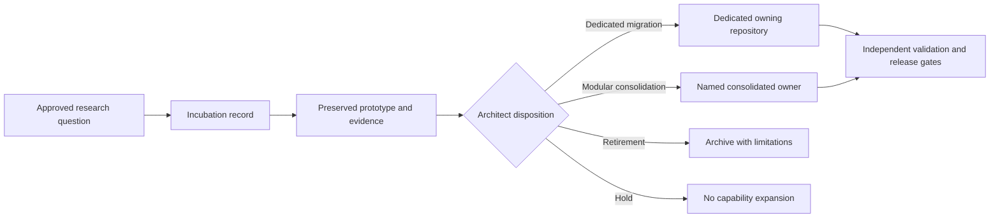

# Misc

`Misc` is the portfolio’s **holding and incubation repository** for experimental security, verification, and systems work that has not yet received a permanent owning repository, approved release scope, or operational authority.

The current contents include the **XYZ / PhantomBlock defensive firmware-assessment prototype** under `phantomblock/`. That implementation is preserved as research evidence, but it is not an accepted product, certified detector, approved deployment, or authorization to assess third-party systems.

## Start here

- [Incubation status and evidence boundaries](phantomblock/docs/incubation-status.md)
- [XYZ documentation front door](phantomblock/docs/index.md)
- [Architecture and trust boundaries](phantomblock/docs/architecture.md)
- [Incubation exit and migration playbook](phantomblock/docs/incubation-exit-and-migration.md)
- [Safe onboarding](phantomblock/docs/onboarding.md)
- [Developer guide](phantomblock/docs/developer-guide.md)
- [Threat model](phantomblock/docs/threat-model.md)
- [Validation roadmap](phantomblock/docs/validation.md)
- [Repository punch list](punchlist.md)
- [Task chain](taskchain.md)
- [Release plan](release.md)
- [Changelog](changelog.md)

## Repository posture

| Area | Current posture |
|---|---|
| Portfolio priority | `P4 — HOLDING / INCUBATION` |
| Prototype state | Preserved, implemented, and not accepted for release |
| Ownership | Unresolved; dedicated migration, modular consolidation, evidence-preserving retirement, or continued hold decision required |
| Incubation exit | `INCUBATION_EXIT_DOCUMENTED_DISPOSITION_UNAPPROVED` |
| GitHub Pages | Manual-only and fail-closed unless `release.md` is explicitly `READY` |
| Package/image release | Blocked |
| Operational use | Blocked except bounded, authorized laboratory evaluation |
| Certification or ATO claims | Not established |

## Safe contribution boundary

Documentation, evidence classification, reproducibility, risk analysis, migration planning, consolidation planning, retirement evidence, and rollback preparation may proceed. Feature expansion, production adapters, credentialed management-plane access, disruptive isolation, package publication, image publication, Pages deployment, certification claims, or operational integration require separate explicit approval.

Use only systems you own or are explicitly authorized to assess. Do not place credentials, proprietary firmware, sensitive packet captures, customer data, private findings, or production evidence in this public repository.

## Architecture in one view

**Equivalent prose:** A research question enters `Misc` only as an incubation record. Any prototype and its evidence are preserved without becoming an accepted product. An Architect must later choose dedicated migration, modular consolidation, evidence-preserving retirement, or continued hold. Migration or consolidation moves only an approved subset under a named owner, where independent validation and release gates begin; retirement preserves history and limitations; a hold prevents further capability expansion.

## FYSA-120 capability map

This documentation work uses the skill tree as a planning aid, especially `CAT-011` for accessible diagrams, `CAT-012` for documentation architecture, `CAT-013` for classification and provenance, `CAT-017` for evidence lineage, `CAT-018` for institutional memory, `CAT-019` for accessible explanation, `CAT-031` for validation and regression prevention, `CAT-040` for migration and rollback, and `CAT-052` for security-governance boundaries. Taxonomy mapping does not establish competence, ownership, permission, or authority.

Proposed non-authoritative refinement: **`040-P — Incubation exit, authority-neutral migration, modular consolidation, and evidence-preserving retirement`**.
