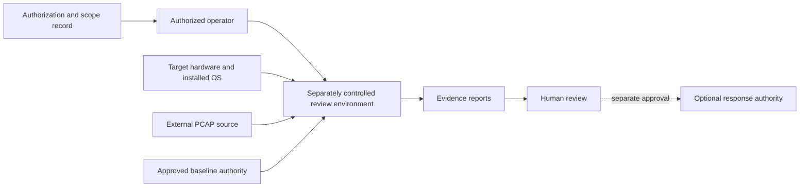
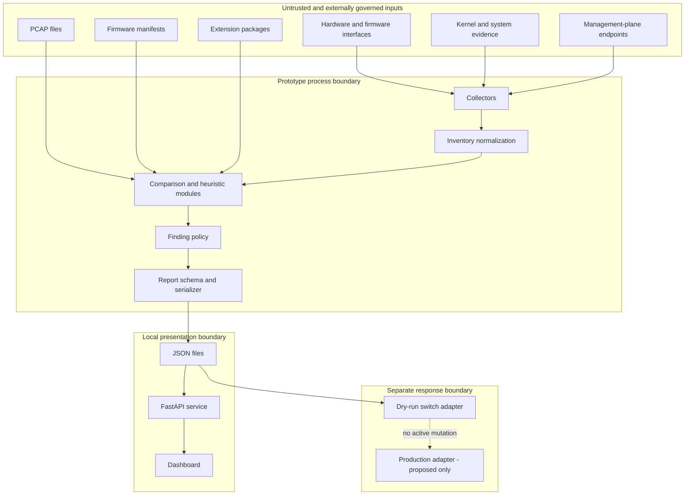
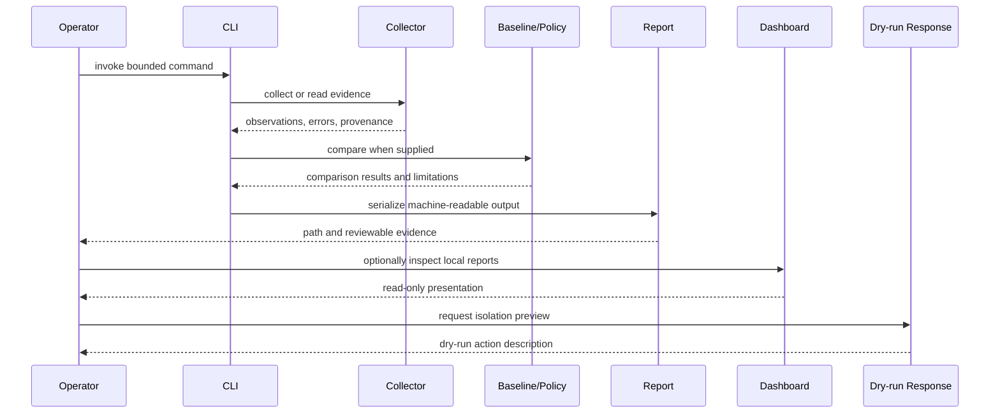

# Architecture

## Status of this document

This architecture describes the current XYZ / PhantomBlock prototype and the boundaries required for a future accepted system. It does not establish representative hardware support, trusted operation, production deployment, certification, or release approval.

Use the following classifications throughout:

- **implemented** — source or configuration exists;
- **configured** — a workflow or build path exists but accepted run evidence may not;
- **proposed** — a future contract or control is documented;
- **validated** — retained evidence exists for a bounded environment and immutable commit;
- **approved** — a named authority has accepted the capability under recorded conditions.

Most components below are implemented or configured; the complete architecture is not yet validated or approved.

## System context

The target, firmware, network captures, third-party extensions, and device responses remain untrusted inputs. The review environment is intended to reduce dependence on the installed operating system, not to eliminate all trust and supply-chain risk.

## Logical component model

## Runtime sequence

The current CLI orchestrates collection, PCAP inspection, dashboard serving, and dry-run isolation. It does not establish a hardened multi-user service, trusted remote control plane, or production response workflow.

## Component responsibilities

### Command-line interface

**Implemented.** The CLI exposes the prototype command families `collect`, `inspect-pcap`, `dashboard`, and `isolate`.

Responsibilities:

- parse explicit operator input;
- invoke bounded modules;
- write reports to caller-selected paths;
- keep dashboard binding local by default;
- keep isolation dry-run only.

Non-responsibilities:

- authenticate an organization or operator;
- prove assessment authorization;
- manage secrets;
- schedule fleet-wide work;
- approve findings or response actions.

### Collection and inventory

**Implemented prototype.** Collection code gathers hardware, firmware, kernel, and system evidence using available environment tools and interfaces.

Required architectural properties for any future accepted implementation:

- read-only or passive operation by default;
- explicit capture of command failures and unsupported states;
- tool and environment version recording;
- bounded execution and output size;
- no silent elevation or credential discovery;
- raw-evidence retention where legally and operationally appropriate.

### Baseline comparison

**Partially implemented; governance unapproved.** A supplied manifest may be used for comparison. The repository does not yet establish an approved authority for obtaining, signing, updating, revoking, licensing, or distributing trusted baselines.

A mismatch must remain a comparison result, not an automatic compromise conclusion.

### Heuristic findings

**Implemented prototype; validation incomplete.** Kernel, management-plane, hardware, firmware, and traffic observations may produce findings.

The architecture keeps observations, rules, severity, and final interpretation conceptually separate so that:

- raw evidence can be independently reviewed;
- false positives can be characterized;
- policy changes do not rewrite history;
- unsupported inputs remain visible;
- corroboration requirements can be explicit.

### PCAP inspection

**Implemented offline path.** PCAP input is analyzed as a supplied file. This does not authorize packet capture, network interception, retention, or disclosure.

Future validation must cover malformed files, parser resource limits, encrypted traffic limitations, capture provenance, privacy handling, and unsupported link types.

### Extension registry

**Implemented discovery seam; security model incomplete.** Entry-point loading allows passive extensions to be registered. In-process extension execution is a significant trust boundary.

A future accepted design must define:

- provenance and allowlisting;
- version compatibility;
- process or sandbox isolation;
- resource limits;
- network and filesystem restrictions;
- schema validation;
- failure containment;
- review and revocation.

### Reporting API and dashboard

**Implemented local presentation path.** Reports can be served through a FastAPI application and simple dashboard.

Current architectural boundary:

- default loopback binding;
- read-only interpretation of report files;
- no claim of authentication, tenancy, remote hardening, retention governance, or incident-case management.

Any remote or multi-user deployment requires a separate design and approval.

### Response adapter

**Implemented dry-run abstraction only.** The current adapter returns a proposed isolation action without performing target mutation.

Production response would require a separately owned control plane with authentication, allowlists, human approval, audit logs, idempotency, rollback, post-action verification, and partial-failure handling. That capability is outside the current approved scope.

### Build and live-image definitions

**Configured, not release-approved.** The repository contains build-oriented definitions for standalone and live-image artifacts. Their presence does not establish reproducible builds, signing, measured boot, trusted media handling, supported hardware, or safe deployment.

### Documentation and Pages

**Implemented documentation; deployment contained.** MkDocs content exists and a Pages workflow is configured. Publication is manual-only and guarded by an explicit `READY` status check in the root release plan.

Documentation may explain the prototype but must not imply that it is released, validated, certified, or operationally available.

## Trust zones

| Zone | Examples | Default trust | Required controls |
|---|---|---:|---|
| Operator and authorization | Human reviewer, scope record | External | Identity, authorization reference, least privilege, auditability. |
| Target | Hardware, installed OS, firmware, management interfaces | Untrusted | Passive access, failure visibility, no automatic conclusions. |
| Review environment | Python runtime, tools, boot media | Partially trusted | Reproducible dependencies, verified artifacts, controlled configuration. |
| Baseline authority | Vendor or organizational manifests | Separately governed | Provenance, signatures, applicability, revocation, licensing. |
| Extensions | Third-party packages | Untrusted | Allowlisting, isolation, versioning, resource limits, review. |
| Reports | JSON, dashboard data, findings | Sensitive evidence | Integrity, minimization, access control, retention, redaction. |
| Response authority | Switch or remediation integration | Highest risk | Separate authentication, approval, dry run, audit, rollback. |
| Publication | Pages, packages, images, release artifacts | Public impact | Explicit approval, claims review, provenance, withdrawal plan. |

## Failure behavior

The desired failure model is fail-closed for authority and fail-visible for evidence:

- unsupported collection should report `unsupported`, not `clean`;
- denied access should report `denied`, not omit the device;
- malformed input should produce a bounded error, not partial silent interpretation;
- unavailable baselines should prevent comparison claims;
- extension failure should not corrupt unrelated evidence;
- dashboard errors should not modify report artifacts;
- response failure should perform no active mutation and should expose partial state;
- publication should stop unless release status is explicitly ready.

## Architectural exclusions

The current architecture does not include or approve:

- autonomous scanning or target discovery;
- credential harvesting or bypass;
- firmware flashing or destructive remediation;
- unrestricted remote agents;
- production switch control;
- customer tenancy or cloud service operation;
- comprehensive implant detection;
- attribution to a specific actor;
- certification or authorization status;
- permanent ownership by `Misc`.

## Next architectural decision

The architecture cannot mature into a release design until XYZ is assigned a dedicated repository and owner or formally retired. See [Ownership and release](ownership-and-release.md) for the required decision record and migration gates.