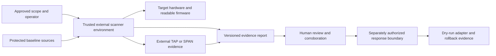
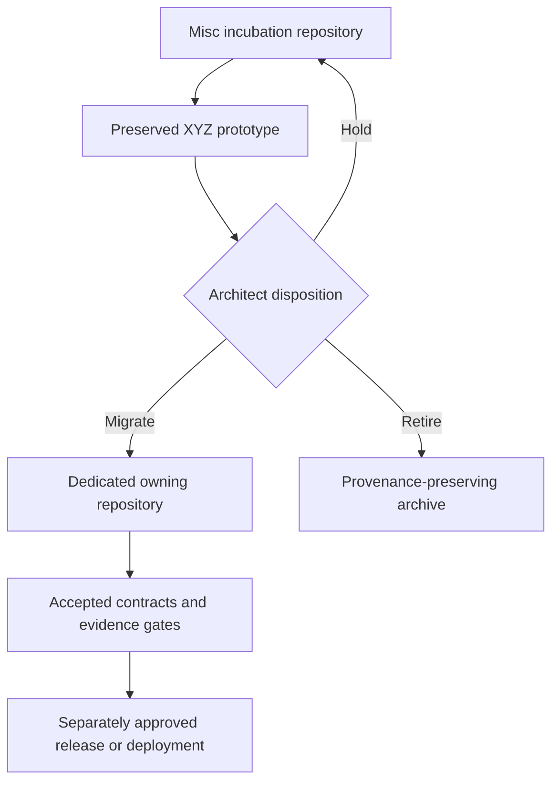

# Architecture and Trust Boundaries

XYZ is a preserved research prototype. The architecture below describes intended component separation and current implementation shape; it does not establish production trust, supported hardware, safe deployment, or accepted interface ownership.

## System context

**Equivalent prose:** An approved operator defines the scope. A trusted external scanner environment reads target hardware and firmware, consumes protected baseline sources, and may also receive packet evidence from an external TAP or SPAN point. These inputs produce a versioned evidence report. Human review and corroboration are required before entering a separate response boundary. Any response adapter begins in dry-run mode and requires rollback evidence.

## Portfolio boundary

**Equivalent prose:** `Misc` preserves the prototype until an Architect records a disposition. A hold keeps it in incubation without capability expansion. Migration moves it to a dedicated repository where accepted contracts and evidence gates can be established. Retirement creates an archive that preserves provenance and limitations. Release or deployment remains a separate later approval.

## Components

### Trusted external environment

A `mkosi` definition describes a bootable Linux environment with read-only-root intent and volatile runtime state. Operational use would still require verified boot, signing, measured-boot evidence, approved media handling, configuration control, trusted build provenance, and independent recovery testing.

### Inventory engine

The engine gathers PCI, DMI, CPU, block, network, module, and firmware observations using tools in the external environment. Raw command output should be retained or content-addressed so normalization does not erase evidence needed for review.

### Baseline and integrity comparison

Readable firmware artifacts may be hashed and compared with a manifest. A hash match or mismatch is only an observation. A trustworthy baseline additionally requires approved source, acquisition evidence, custody, version and platform binding, signature or other authenticity evidence, update and revocation rules, and protection from deriving the baseline from the system under assessment.

### Detection modules

Kernel, management-plane, firmware, and traffic-analysis modules produce findings. Collection, interpretation, severity policy, and final disposition remain separate so a heuristic or open service cannot become an unsupported compromise conclusion.

### Extension registry

Passive capabilities use a versioned extension seam. The passive registry must reject target mutation. Before any third-party extension can be treated as supported, it needs identity, version, dependency, permission, input/output, failure, privacy, correction, migration, retirement, and rollback documentation.

### Report and review boundary

Reports use a versioned JSON shape and may feed a local service or dashboard. The report is evidence transport, not a verdict. Future sinks such as SIEM or authorization-package exports require separate contracts, redaction policy, consumer registration, retention rules, correction propagation, and rollback.

### Response boundary

Network isolation or other mutation uses a separate adapter interface. The included conceptual adapter is dry-run only. Production response requires explicit authorization, strong authentication, target allowlists, bounded scope, independent review, audit logs, idempotency, queued and in-flight action handling, verification of the resulting state, and tested rollback.

## Trust assumptions and unresolved ownership

| Boundary | Required trust or owner | Current state |
|---|---|---|
| External scanner build | Build and media custodian | Unassigned / unverified |
| Firmware baselines | Source, signing, update, and revocation owners | Unassigned |
| Target authorization | Scope approver and operator | Must be supplied outside the repository |
| Packet evidence | Capture authority, privacy, and retention owners | Unassigned |
| Report schema | Producer, consumer, and migration owners | Prototype only |
| Dashboard/API | Access, authentication, and disclosure owners | Prototype only |
| Response adapter | Operational approver and rollback owner | Blocked |
| Publication | Privacy, security, license, accessibility, and release approvers | Blocked |
| Repository disposition | Architect | Decision required |

## Failure and obstruction conditions

The architecture must fail closed when:

- the source or authorization is ambiguous;
- the external environment cannot be verified;
- a baseline lacks independent provenance;
- a parser or extension receives malformed or unsupported input;
- a finding is promoted into a conclusion without corroboration;
- a passive interface can mutate the target;
- evidence correction cannot reach all controlled consumers;
- a migration changes semantics or loses provenance;
- a response action lacks resulting-state and rollback verification;
- documentation, package metadata, CI, or publication is treated as release authority.

## Interface documentation requirement

Before an interface becomes stable, document its namespace, version, canonical bytes if applicable, producer and consumer, ordering, retry, duplicate and replay behavior, correction and revocation, retention, privacy classification, compatibility, migration, retirement, and rollback. The current prototype interfaces do not satisfy an accepted cross-repository contract.
