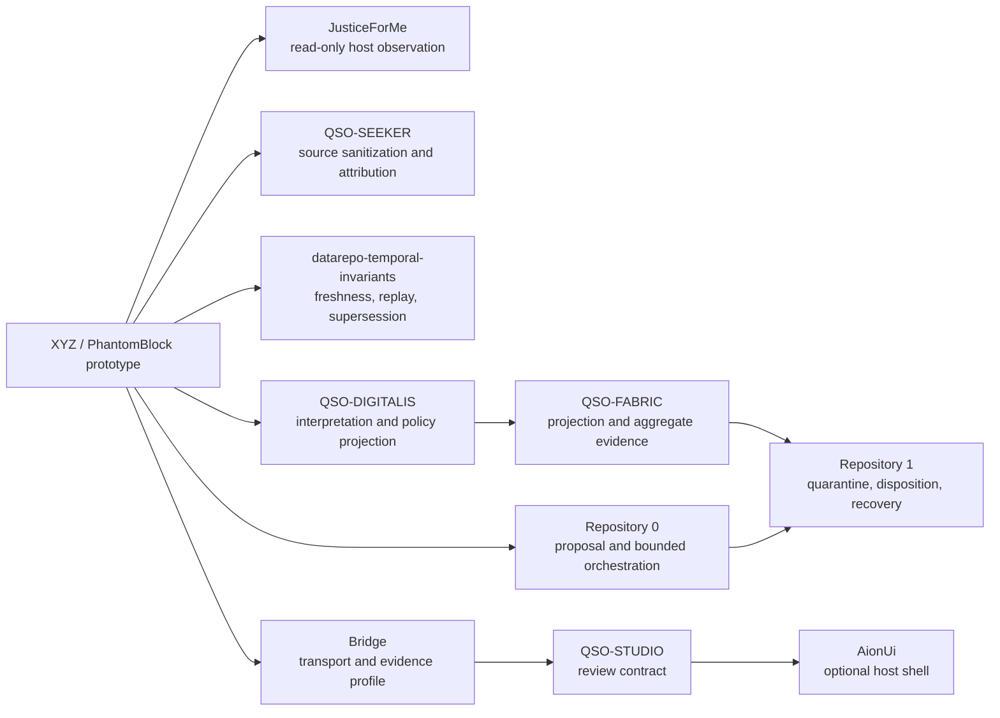

# Component and Portfolio Overlap Inventory

## Status

`COMPONENT_OVERLAP_INVENTORY_DOCUMENTED_DISPOSITION_UNAPPROVED`

This inventory classifies the observed XYZ / PhantomBlock component families and their likely portfolio overlaps. It supports an incubation-exit decision; it does **not** choose a destination, appoint an owner, accept an interface, authorize migration, certify behavior, or approve release, publication, deployment, credentials, firmware handling, packet capture, or disruptive response.

The inventory is intentionally conservative. A path family is **observed** when repository documentation or package metadata identifies it. A component is **implemented prototype evidence** when code or configuration is stated to exist. Neither status establishes completeness, correctness, support, compatibility, or authority. A complete path-and-hash manifest remains a separate required artifact.

## Evidence sources and precedence

1. Exact repository source at the reviewed commit.
2. `phantomblock/pyproject.toml` for package identity, dependency families, entry points, and source/test layout.
3. `README.md`, `taskchain.md`, `release.md`, `punchlist.md`, and `changelog.md` for scope and lifecycle controls.
4. `phantomblock/docs/architecture.md`, `developer-guide.md`, `threat-model.md`, and `incubation-exit-and-migration.md` for component boundaries and proposed dispositions.
5. Historical workflow, package, image, and compliance records as historical evidence only.

When sources disagree, the conflict remains visible and the stronger claim is blocked.

## Observed component families

| ID | Observed path or surface | Prototype role | Evidence class | Authority boundary | Candidate disposition questions |
|---|---|---|---|---|---|
| C01 | `phantomblock/pyproject.toml` | Package metadata, dependency groups, console entry points, extension entry-point namespace | Implemented metadata | Version `0.3.0` is not an approved release or compatibility promise | Rename, preserve, deprecate, or retire under an approved owner |
| C02 | `phantomblock/src/phantomblock/` | Python source package | Implemented prototype family | No supported-platform, detection, or operational claim | Move as one bounded package, split by component, or archive |
| C03 | `xyz` and `phantomblock` console entry points | Local command interface | Implemented prototype interface | No authorization to scan third-party or production systems | Preserve only after command, input, output, privilege, and failure contracts are accepted |
| C04 | Inventory collectors | PCI, DMI, CPU, storage, network, module, and firmware observations | Implemented prototype family | Collection is not interpretation or compromise determination | Compare with JusticeForMe and Repository `0` observation ownership |
| C05 | Firmware and baseline comparison | Hashing and manifest comparison | Implemented prototype family | A digest is not a trusted baseline or authenticity proof | Assign baseline-source, custody, update, revocation, and signing ownership |
| C06 | Kernel and low-level heuristics | Kernel, module, hook, taint, or related finding generation | Implemented prototype family | Heuristic output is not a verdict | Decide whether retained here, moved to a specialist adapter, or retired |
| C07 | Management-plane assessment | AMT, IPMI, Redfish, BMC, and related observations | Implemented prototype family | No credential bypass, exploitation, or active management authority | Require explicit credential, privilege, network, legal, and target-authorization boundaries |
| C08 | External packet analysis | Offline PCAP or TAP/SPAN evidence analysis | Implemented prototype family | No covert capture, unrestricted collection, or publication of sensitive traffic | Separate capture authority from offline interpretation and retention |
| C09 | Report schema and evidence output | Versioned machine-readable findings and supporting observations | Prototype interface | Transport does not create truth, approval, or canonical state | Reconcile with Bridge, QSO-STUDIO, Repository `1`, and public-claim correction routes |
| C10 | Dashboard and local API | Human review and local presentation | Implemented prototype family | UI, HTTP response, or rendered status cannot create approval | Compare with QSO-STUDIO review contract and AionUi host-shell boundary |
| C11 | Passive extension registry | Third-party capability entry-point seam | Configured prototype interface | Extension discovery is not admission or trust | Define package identity, permission, failure, privacy, correction, migration, and retirement contracts |
| C12 | Dry-run response or isolation abstraction | Proposed or prototype disruptive-response seam | Implemented conceptual boundary | Mutation remains separately blocked | Assign independent approver, allowlist, authentication, audit, idempotency, rollback, and resulting-state witness |
| C13 | `phantomblock/tests/` | Unit and documentation regressions | Implemented test family | Passing tests do not establish hardware coverage or detection accuracy | Preserve as source evidence; expand only with synthetic, authorized fixtures |
| C14 | `phantomblock/docs/` and `phantomblock/mkdocs.yml` | Pages-ready documentation and navigation | Implemented documentation family | Documentation success is not publication or release approval | Preserve with exact-generation review, accessibility, privacy, licensing, correction, and withdrawal controls |
| C15 | CI and Pages workflows | Validation and manual publication capability | Configured automation | Workflow presence or success is not authority | Keep least-privilege, exact-head, artifact-retaining, manual-only, fail-closed behavior |
| C16 | Live-image definition | External scanner environment candidate | Implemented build definition | No trusted boot, signing, media custody, or deployment approval | Assign build provenance, platform matrix, signing, recovery, and media-handling ownership |
| C17 | Binary and SBOM build scripts | Packaging and supply-chain evidence candidate | Implemented build family | Build output is not a release | Require reproducibility, dependency pinning, checksums, vulnerability review, signatures, and retention |
| C18 | Compliance mappings | CMMC, STIG, Army, or related preparation material | Documentation evidence | No certification, authorization, or ATO claim | Retain only as clearly non-authoritative crosswalks under a named compliance reviewer |

## Portfolio overlap map

**Equivalent prose:** XYZ overlaps with JusticeForMe in host observation, Repository `0` in proposal and bounded orchestration, QSO-SEEKER in source sanitization and attribution, the temporal repository in freshness and replay, QSO-DIGITALIS in interpretation and policy projection, Bridge in transport, QSO-STUDIO in review, AionUi in presentation, QSO-FABRIC in projection and aggregation, and Repository `1` in quarantine, disposition, correction, revocation, checkpointing, and recovery. These are candidate relationships only. No edge is accepted, and no missing adapter may be synthesized silently.

## Overlap and ownership ledger

| Overlap | Shared concern | Material conflict or vacancy | Safe default | Required witness before composition |
|---|---|---|---|---|
| XYZ ↔ JusticeForMe | Host inventory and read-only observations | Duplicate collectors and unclear canonical observation vocabulary | Preserve both; do not merge findings by name | Field-level source, privilege, platform, correction, and loss comparison |
| XYZ ↔ Repository `0` | Local proposal and bounded execution preparation | XYZ contains local CLI and response concepts that could bypass proposal/quarantine separation | Observation and proposal only; no execution authority | Proposal identity, protected paths, capability class, receipt, rollback, and wrong-device fixtures |
| XYZ ↔ Repository `1` | Disposition, revocation, checkpoint, and recovery | No accepted report-to-disposition contract or independent authority root | Repository `1` route remains unsupported | Evidence identity, admission, human decision, revocation acknowledgment, checkpoint ancestry, restoration witness |
| XYZ ↔ QSO-SEEKER | Source acquisition, sanitization, attribution | Packet, firmware, and command evidence may lack source-rights and sanitizer provenance | Treat inputs as untrusted and private by default | Source identity, rights, sanitizer transform, loss, retention, withdrawal, and deletion witness |
| XYZ ↔ temporal repository | Freshness, replay, supersession | Firmware baselines and reports can become stale without accepted temporal subject rules | Stale or unknown evidence cannot promote a claim | Subject identity, observation time, valid interval, supersession, replay, and clock-failure witness |
| XYZ ↔ QSO-DIGITALIS | Interpretation and policy projection | Heuristics, severity policy, and domain conclusions can collapse into one record | Preserve observations and interpretations separately | Source set, transform, uncertainty, reason code, correction, and policy-generation witness |
| XYZ ↔ Bridge | Transport and handoff | No accepted envelope, canonical serialization, retry, duplicate, or privacy contract | No external handoff | Producer/consumer, bytes, digest, ordering, replay, redaction, error, and receipt witness |
| XYZ ↔ QSO-STUDIO | Human review | Dashboard state may be mistaken for review or approval | Display and annotation only | Packet identity, evidence links, reviewer action, dissent, correction, export, and approval-separation witness |
| QSO-STUDIO ↔ AionUi | Review presentation | Host-shell sessions and UI state could be treated as canonical review state | Optional rendering only | Contract version, session isolation, accessibility, export integrity, and no-authority witness |
| XYZ ↔ QSO-FABRIC | Projection and aggregate evidence | Aggregation can duplicate, flatten, or inflate evidence and authority | Projection route unsupported | Source-set completeness, loss accounting, duplicate/conflict handling, correction closure, and aggregate non-authority witness |

## Gluing failures that block migration or consolidation

1. **Identity collapse:** observation, finding, interpretation, review, proposal, receipt, and disposition records are not accepted as distinct canonical identities.
2. **Privilege collapse:** passive collection, credentialed management access, and disruptive response are not protected by accepted capability classes.
3. **Baseline circularity:** a baseline derived from the assessed device can be mistaken for independent trusted evidence.
4. **Temporal discontinuity:** firmware, policy, and report generations lack accepted freshness, supersession, replay, and clock-failure behavior.
5. **Lossy projection:** aggregation or transport can omit source sets, uncertainty, privacy effects, corrections, or revocations.
6. **Consumer orphaning:** no accepted registry proves every controlled consumer received a correction, withdrawal, or revocation.
7. **Duplicate authority:** overlapping collectors, dashboards, envelopes, or disposition paths can remain active after consolidation.
8. **History ambiguity:** copied files can become indistinguishable from destination-authored work without source-to-target mapping.
9. **Rollback resurrection:** restoring source or destination state can revive withdrawn claims, revoked capabilities, stale baselines, or obsolete public content.
10. **Self-attested restoration:** the component being restored cannot be the sole witness that restoration succeeded.

## Decision-ready disposition matrix

| Component family | Dedicated migration | Modular consolidation | Retirement/archive | Continued hold |
|---|---|---|---|---|
| Passive inventory and report generation | Candidate | Candidate with JusticeForMe or named observation owner | Preserve evidence and limitations | Freeze capability changes |
| Firmware baseline comparison | Candidate only with independent baseline governance | Candidate under a named verification owner | Preserve unsupported prototype | Freeze and mark baselines untrusted |
| Management-plane and packet analysis | Candidate only with explicit legal/privacy/credential boundaries | Split into source, interpretation, and transport owners | Preserve without operational instructions where disclosure risk exists | Freeze |
| Dashboard/API and review presentation | Candidate only under accepted review contract | Consolidate with QSO-STUDIO/AionUi boundaries | Preserve screenshots/specification as historical evidence | Freeze network and publication behavior |
| Passive extension registry | Candidate after admission and permission contract | Consolidate under a neutral plugin/adapter owner | Retire unsupported third-party seam | Freeze extension admission |
| Dry-run response abstraction | Separate dedicated security-response owner only | Do not merge into passive collector | Retire if no independent authority and rollback owner exists | Keep disabled |
| Build, image, SBOM, CI, and Pages | Rebuild under destination provenance | Consolidate only after package and publication ownership | Preserve reproducibility evidence and disable publication | Manual validation only |
| Compliance mappings | Move only with reviewer and evidence labels | Consolidate into portfolio compliance documentation | Archive as non-authoritative preparation | Keep clearly non-certifying |

## Completion boundary

This milestone completes a **component-family and repository-overlap inventory**. It does not complete the required exact file-level manifest. The next bounded artifact must enumerate every retained path with blob or content digest, component ID, evidence class, sensitive-data classification, source commit, proposed disposition, target or archive path, semantic owner or vacancy, known losses, correction route, and rollback treatment.

Until that manifest and an Architect disposition exist:

- Local P0.2 remains in review rather than done;
- source movement and consolidation remain blocked;
- no package, image, Pages site, dashboard, service, adapter, or compliance claim may be promoted;
- every overlap edge remains candidate or unsupported.

## Reviewer onboarding

1. Confirm the exact source commit and the current lifecycle documents.
2. Review C01–C18 and mark any missing, duplicated, obsolete, or misclassified component family.
3. Review each overlap edge without inferring ownership from code location or name similarity.
4. Record conflicts, vacancies, sensitive-data concerns, and required witnesses.
5. Do not select migration, consolidation, retirement, or hold within this inventory; route that decision to the Architect packet.
6. Rebind or withdraw the inventory whenever source paths, package metadata, interfaces, overlaps, safety boundaries, or lifecycle status change.

## FYSA-120 capability map

Applied capabilities:

- `011-B` and `011-E` for accessible diagrams and diagram–prose consistency;
- `012-A`, `012-B`, `012-D`, and `012-E` for information architecture, contract exposition, terminology controls, testing, and lifecycle synchronization;
- `013-A`, `013-C`, `013-D`, and `013-E` for component graphs, identity resolution, path reasoning, contradiction detection, and provenance-aware updates;
- `017-C`, `017-D`, and `017-E` for lineage, source substitution detection, preservation, and correction propagation;
- `018-B`, `018-D`, and `018-E` for records classification, responsibility mapping, onboarding transfer, and contested-history preservation;
- `019-B`, `019-C`, and `019-D` for plain-language status, accessibility, and risk communication;
- `031-A`, `031-D`, and `031-E` for interface requirements, overlap validation, regression prevention, and assurance maintenance;
- `032-A`, `032-D`, and `032-E` for distributed boundaries, partial failure, recovery, observability, and incident diagnosis;
- `040-A`, `040-B`, `040-D`, and `040-E` for system archaeology, dependency risk, migration, rollback, and continuity.

Proposed non-authoritative refinement:

**`013-M — Incubated component-family inventories, cross-repository overlap ledgers, and disposition-safe ownership graphs`**.

Taxonomy selection does not establish competence, appointment, ownership, approval, or authority.
