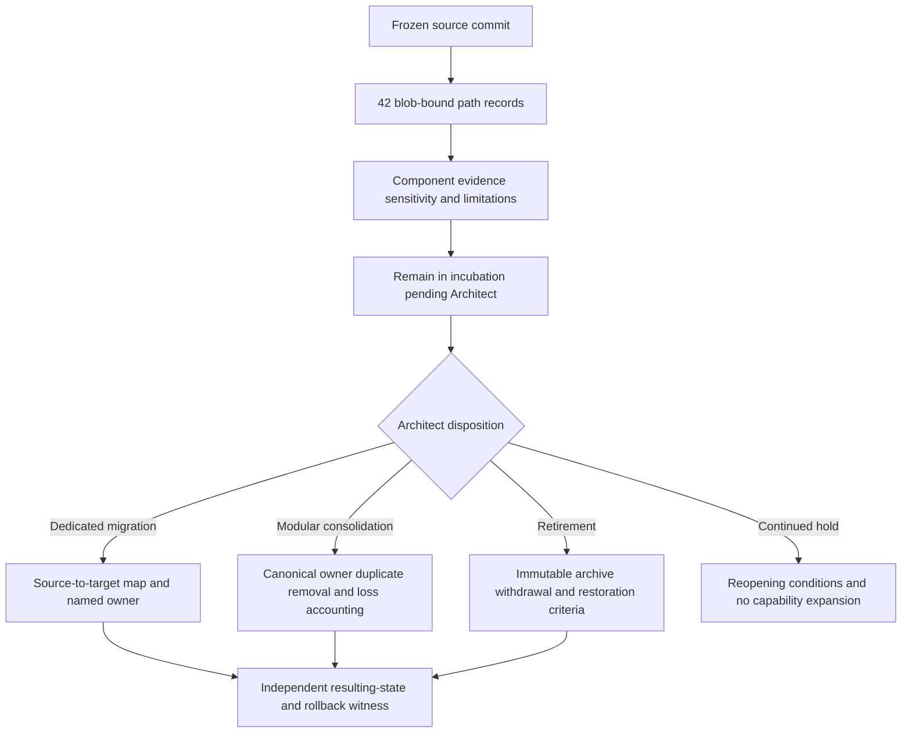

# Exact file-level evidence and disposition manifest

## Status

`FILE_DISPOSITION_MANIFEST_COMPLETE_FOR_FROZEN_SOURCE_DECISION_UNAPPROVED`

This manifest binds every tracked path in the reviewed XYZ / PhantomBlock source generation to its immutable Git blob identity, component family, evidence class, sensitivity class, current fail-closed disposition, ownership vacancies, correction route, and rollback treatment. It completes the bounded source-inventory task; it does **not** choose or execute migration, consolidation, retirement, publication, release, deployment, credentials, privileged collection, active response, or destructive history rewriting.

Machine-readable companion: [file-disposition-manifest-v1.json](file-disposition-manifest-v1.json).

## Frozen-source boundary

| Field | Value |
|---|---|
| Repository | `aevespers2/Misc` |
| Immutable source | `68703e138ffa1df26924dd4e018078a246531ace` |
| Digest kind | Git blob SHA-1 |
| Expected tracked paths | `42` |
| Recorded paths | `42` |
| Duplicate or unclassified paths | `0` |
| Current disposition | `REMAIN_IN_INCUBATION_PENDING_ARCHITECT` |
| Semantic owner | `VACANT` |
| Interface owner | `VACANT` |
| Successor behavior | Any source change makes this a historical manifest and requires explicit rebinding or supersession |

The two files that publish this manifest are deliberately excluded from the frozen set:

- `phantomblock/docs/file-disposition-manifest.md`;
- `phantomblock/docs/file-disposition-manifest-v1.json`.

Including generated manifest files in their own digest set would create an impossible self-referential hash requirement. Their exclusion is explicit, bounded, and machine-readable rather than silently omitted.

## Disposition flow

**Equivalent prose:** An immutable source commit is decomposed into 42 path records, each bound to a Git blob and classified by component, evidence, sensitivity, and known limitations. Every record remains in incubation while authority is absent. An Architect may later select dedicated migration, modular consolidation, evidence-preserving retirement, or continued hold. Migration requires a source-to-target map and named owner; consolidation additionally requires canonical ownership, duplicate-authority removal, and loss accounting; retirement requires an immutable archive, withdrawal controls, and restoration criteria; a hold requires reopening conditions and no capability expansion. Any changed route remains incomplete until an independent reviewer verifies the resulting and restorable states.

## Exact path ledger

The table records source facts only. The common disposition, owner, correction, and rollback fields below apply to every row.

| Path | Git blob SHA-1 | Component IDs | Evidence class | Sensitivity class | Limitation refs |
|---|---|---|---|---|---|
| `.github/workflows/documentation-candidate.yml` | `55ffa00bacdda61afcf462c5cad71719761243d2` | `C15` | `CONFIGURED_AUTOMATION` | `PUBLIC_AUTOMATION` | `L08`, `L10` |
| `.github/workflows/pages.yml` | `bdbd2a76cee2a08d40e860ef33d2e819c4f5ea1f` | `C15` | `CONFIGURED_AUTOMATION` | `PUBLIC_AUTOMATION` | `L08`, `L10` |
| `.github/workflows/phantomblock-ci.yml` | `8130669dcd984e44af71e6cee3f822aff010c2c4` | `C15`, `C13` | `CONFIGURED_AUTOMATION` | `PUBLIC_AUTOMATION` | `L08`, `L10` |
| `README.md` | `bdac9010232a7afdddfe0a433fa6e255f63edf84` | `C14` | `DOCUMENTATION_AND_PLANNING_EVIDENCE` | `PUBLIC_DOCUMENTATION` | `L01`, `L09` |
| `changelog.md` | `fe979e0f29b83b63f0f676925ff9915c1670e5f6` | `C14` | `DOCUMENTATION_AND_PLANNING_EVIDENCE` | `PUBLIC_DOCUMENTATION` | `L01`, `L09` |
| `phantomblock/README.md` | `7bc9f4fbf6dea505807d789472447901ce05ef22` | `C14`, `C01` | `DOCUMENTATION_AND_PLANNING_EVIDENCE` | `PUBLIC_DOCUMENTATION` | `L01`, `L09` |
| `phantomblock/compliance/README.md` | `7bb1d30ab79d189a74bda8344aeda8795d920c66` | `C18` | `NON_AUTHORITATIVE_COMPLIANCE_PREPARATION` | `PUBLIC_DOCUMENTATION` | `L01`, `L07` |
| `phantomblock/compliance/control-mapping.yml` | `04d8d047580ec4e5acabdbab2ac00d86e3fe6921` | `C18` | `NON_AUTHORITATIVE_COMPLIANCE_PREPARATION` | `PUBLIC_DOCUMENTATION` | `L01`, `L07` |
| `phantomblock/config/known_good.example.yml` | `0ddbf46eb1e37d49cf2d02e77a48a4fbe8305e2b` | `C05` | `SYNTHETIC_BASELINE_EXAMPLE` | `PUBLIC_SYNTHETIC_CONFIGURATION` | `L03`, `L06` |
| `phantomblock/docs/architecture.md` | `d8dc7aceaec8a51ff260dd7a3e6be407f0901d03` | `C14` | `DOCUMENTATION_AND_PLANNING_EVIDENCE` | `PUBLIC_DOCUMENTATION` | `L01`, `L09` |
| `phantomblock/docs/compliance.md` | `898e48923d43b32cdf417d787f5b9e4cc5c28d6b` | `C14`, `C18` | `NON_AUTHORITATIVE_COMPLIANCE_PREPARATION` | `PUBLIC_DOCUMENTATION` | `L01`, `L07` |
| `phantomblock/docs/component-overlap-inventory-v1.json` | `2939ae2da9f7a7eae200cc4e20e3b50a32e21e8e` | `C14` | `GOVERNANCE_INVENTORY` | `PUBLIC_DOCUMENTATION` | `L01`, `L09` |
| `phantomblock/docs/component-overlap-inventory.md` | `868ae04bd3f6ee7e80538e48eeb38ad0c0b48dd4` | `C14` | `GOVERNANCE_INVENTORY` | `PUBLIC_DOCUMENTATION` | `L01`, `L09` |
| `phantomblock/docs/deployment.md` | `18a0c2729f7e56c0ea78be9ffe611cc59c249baf` | `C14`, `C16`, `C17` | `DOCUMENTATION_AND_PLANNING_EVIDENCE` | `PUBLIC_DOCUMENTATION` | `L01`, `L08` |
| `phantomblock/docs/developer-guide.md` | `9798ebca3d2ae32da5c72de37a93aa409e3f65b6` | `C14`, `C13` | `DOCUMENTATION_AND_PLANNING_EVIDENCE` | `PUBLIC_DOCUMENTATION` | `L01`, `L09` |
| `phantomblock/docs/extensions.md` | `582406959d35d028f88242d8b6df1f4420696fee` | `C14`, `C11` | `DOCUMENTATION_AND_PLANNING_EVIDENCE` | `PUBLIC_DOCUMENTATION` | `L01`, `L05` |
| `phantomblock/docs/incubation-exit-and-migration.md` | `42780784169deda65a1a3f25f2fd1f4fc26bc146` | `C14` | `GOVERNANCE_PLAYBOOK` | `PUBLIC_DOCUMENTATION` | `L01`, `L09` |
| `phantomblock/docs/incubation-status.md` | `15651f5d8c32c124a6a15ac5a03c67fc3e7a9289` | `C14` | `GOVERNANCE_PLAYBOOK` | `PUBLIC_DOCUMENTATION` | `L01`, `L09` |
| `phantomblock/docs/index.md` | `e4102517c513e96ad276fbb2ec99c49efdbb0639` | `C14` | `DOCUMENTATION_AND_PLANNING_EVIDENCE` | `PUBLIC_DOCUMENTATION` | `L01`, `L09` |
| `phantomblock/docs/onboarding.md` | `7f6292a507210a57039e68836ea03f0dc3262180` | `C14` | `GOVERNANCE_PLAYBOOK` | `PUBLIC_DOCUMENTATION` | `L01`, `L09` |
| `phantomblock/docs/purpose.md` | `6cab85251d7ae07a86358376b3e0cd6caffbddf6` | `C14` | `DOCUMENTATION_AND_PLANNING_EVIDENCE` | `PUBLIC_DOCUMENTATION` | `L01`, `L09` |
| `phantomblock/docs/threat-model.md` | `141da898415ba33f8ad58c462eb829c445086065` | `C14` | `GOVERNANCE_PLAYBOOK` | `PUBLIC_DOCUMENTATION` | `L01`, `L09` |
| `phantomblock/docs/validation.md` | `bbcbaa93b5602131c32a9bf726cb7e25b2bd7a42` | `C14`, `C13` | `DOCUMENTATION_AND_PLANNING_EVIDENCE` | `PUBLIC_DOCUMENTATION` | `L01`, `L09` |
| `phantomblock/image/build.sh` | `b5ca469af9f0516ad817e96a8b5419f9f9331892` | `C16` | `LIVE_IMAGE_BUILD_DEFINITION` | `PUBLIC_BUILD_CONFIGURATION` | `L02`, `L08`, `L10` |
| `phantomblock/image/mkosi.conf` | `a9a7ea79a4f91c3d1ecd3ca0a9d8a17927c6617d` | `C16` | `LIVE_IMAGE_BUILD_DEFINITION` | `PUBLIC_BUILD_CONFIGURATION` | `L02`, `L08`, `L10` |
| `phantomblock/mkdocs.yml` | `126cfcdd3b53c378a7371a51d085c8dd2b8b991a` | `C14` | `DOCUMENTATION_AND_PLANNING_EVIDENCE` | `PUBLIC_DOCUMENTATION` | `L01`, `L09` |
| `phantomblock/packaging/build-binary.sh` | `4da415e9a0378ca5915c31e58cc9155f49b6a140` | `C17` | `BINARY_AND_SBOM_BUILD_DEFINITION` | `PUBLIC_BUILD_CONFIGURATION` | `L02`, `L08`, `L10` |
| `phantomblock/packaging/phantomblock.spec` | `b8ffd820fae68de25c2e5a3ba72483b983985b8d` | `C17` | `BINARY_AND_SBOM_BUILD_DEFINITION` | `PUBLIC_BUILD_CONFIGURATION` | `L02`, `L08`, `L10` |
| `phantomblock/pyproject.toml` | `263f49a00f8b0e13a65dd7ebfb0250b8f2737acd` | `C01`, `C03`, `C11`, `C17` | `IMPLEMENTED_PACKAGE_METADATA` | `PUBLIC_SOURCE_METADATA` | `L02`, `L05`, `L10` |
| `phantomblock/src/phantomblock/__init__.py` | `55c627ea0ec9b1f188ad8c6cf12a7368a10e4794` | `C02` | `IMPLEMENTED_PROTOTYPE_SOURCE` | `PUBLIC_SOURCE_CODE` | `L02`, `L11` |
| `phantomblock/src/phantomblock/cli.py` | `36cf90d616ab904c103ee8bacaf21917beefc75e` | `C02`, `C03`, `C04`, `C08`, `C10`, `C12` | `IMPLEMENTED_PROTOTYPE_SOURCE` | `PUBLIC_SOURCE_CODE` | `L02`, `L04`, `L05`, `L06`, `L11` |
| `phantomblock/src/phantomblock/core.py` | `7b56f447709fddb8210b8c5133ef789478964fc7` | `C02`, `C04`, `C05`, `C06`, `C07`, `C08`, `C09` | `IMPLEMENTED_PROTOTYPE_SOURCE` | `PUBLIC_SOURCE_CODE` | `L02`, `L03`, `L04`, `L06`, `L11` |
| `phantomblock/src/phantomblock/dashboard.py` | `19c19a1ad6b4badf7a94951f4e0172f2bfdead65` | `C02`, `C10` | `IMPLEMENTED_PROTOTYPE_SOURCE` | `PUBLIC_SOURCE_CODE` | `L02`, `L04`, `L11` |
| `phantomblock/src/phantomblock/extensions.py` | `d2773b0279e5d4046cdd295ea99ac69545bfee52` | `C02`, `C11` | `IMPLEMENTED_PROTOTYPE_SOURCE` | `PUBLIC_SOURCE_CODE` | `L02`, `L05`, `L11` |
| `phantomblock/src/phantomblock/isolation.py` | `e392b5736a2fa14070719622428811eb7217afec` | `C02`, `C12` | `IMPLEMENTED_PROTOTYPE_SOURCE` | `PUBLIC_SOURCE_CODE` | `L02`, `L04`, `L11` |
| `phantomblock/src/phantomblock/policy.py` | `63e693b66bfe57a7f06504810212638724b1c704` | `C02`, `C09` | `IMPLEMENTED_PROTOTYPE_SOURCE` | `PUBLIC_SOURCE_CODE` | `L02`, `L04`, `L11` |
| `phantomblock/tests/test_core.py` | `584213d75888f82bfdd207122f1e8f33aea420a9` | `C13`, `C04`, `C05`, `C06`, `C07`, `C08`, `C09`, `C11`, `C12` | `UNIT_TEST_SOURCE` | `PUBLIC_TEST_SOURCE` | `L02`, `L06`, `L11` |
| `punchlist.md` | `f4f89aadc05d42f114adf062ae5db1901fd79684` | `C14` | `DOCUMENTATION_AND_PLANNING_EVIDENCE` | `PUBLIC_DOCUMENTATION` | `L01`, `L09` |
| `release.md` | `7a38d6a4863c7df02c62b00f24ce9e35bc8ac153` | `C14` | `DOCUMENTATION_AND_PLANNING_EVIDENCE` | `PUBLIC_DOCUMENTATION` | `L01`, `L09` |
| `scripts/check_documentation_candidate.py` | `f687f40bad9e6e2efc7a76d60f7a41029828fa19` | `C13`, `C14`, `C15` | `DOCUMENTATION_VALIDATION_TOOLING` | `PUBLIC_SOURCE_CODE` | `L01`, `L10` |
| `taskchain.md` | `cffcd5bd41f382ebdb56a135212ed82745049506` | `C14` | `DOCUMENTATION_AND_PLANNING_EVIDENCE` | `PUBLIC_DOCUMENTATION` | `L01`, `L09` |
| `tests/test_documentation_candidate.py` | `cb41e152299f169a451325b596b698655cee3a4e` | `C13`, `C14`, `C15` | `GOVERNANCE_REGRESSION_TEST_SOURCE` | `PUBLIC_TEST_SOURCE` | `L01`, `L10` |

## Common record fields

Every entry inherits these fail-closed values:

- **Current disposition:** `REMAIN_IN_INCUBATION_PENDING_ARCHITECT`.
- **Proposed target or archive path:** `null`.
- **Semantic owner:** `VACANT`.
- **Interface owner:** `VACANT`.
- **Correction route:** `SUPERSEDE_BY_REVIEWED_PULL_REQUEST_BOUND_TO_EXACT_SOURCE_AND_RECORD_IN_CHANGELOG`.
- **Rollback treatment:** restore the recorded blob from the frozen source, preserve history, and do not revive revoked, withdrawn, or superseded authority.

All authority flags remain denied for migration, consolidation, retirement execution, publication, release, credentials, networking, privileged collection, active response, deployment, and destructive history rewriting.

## Limitation catalog

| ID | Limitation |
|---|---|
| `L01` | Documentation, planning, inventories, diagrams, and governance records describe boundaries but do not establish implementation correctness, ownership, acceptance, certification, publication, release, or operational authority. |
| `L02` | Prototype code, package metadata, tests, and build definitions have not been accepted as a supported product or validated across representative platforms. |
| `L03` | Firmware and artifact comparisons depend on independently governed baselines; the example manifest is synthetic and cannot establish authenticity or trust. |
| `L04` | Collection, management-plane, packet, dashboard, and response surfaces require explicit target authorization, privacy review, bounded privilege, and independent human disposition. |
| `L05` | CLI and extension seams lack an accepted admission, permission, dependency, failure, revocation, migration, and retirement contract. |
| `L06` | Existing tests and fixtures are limited and do not establish detection accuracy, false-positive or false-negative rates, trusted inputs, hardware coverage, or adversarial robustness. |
| `L07` | Compliance mappings are preparation evidence only and do not establish CMMC status, STIG approval, Army authorization, certification, or an Authority to Operate. |
| `L08` | Build, image, CI, or Pages configuration is a capability surface rather than release or deployment approval; signing, reproducibility, custody, and rollback remain unresolved. |
| `L09` | Public documentation requires exact-generation accessibility, privacy, licensing, security, provenance, correction, withdrawal, publication, and rollback review before release. |
| `L10` | Workflow or build success is generation-specific evidence and cannot substitute for independent review, retained artifacts, source integrity, or resulting-state verification. |
| `L11` | No accepted canonical record, interface owner, consumer registry, correction or revocation closure, migration contract, or independently verified restoration exists for the prototype runtime. |

## Material obstructions

1. **Disposition vacancy:** every path remains held because no Architect disposition or destination has been accepted.
2. **Ownership vacancy:** code location, package name, and documentation authorship do not appoint semantic, interface, security, publication, correction, or rollback owners.
3. **History-gluing gap:** no accepted source-to-target commit and path map exists.
4. **Contract gap:** no canonical observation, finding, interpretation, review, proposal, disposition, correction, or recovery envelope is accepted.
5. **Privilege gap:** passive collection, credentialed management access, packet handling, dashboard service, extension loading, and disruptive response lack accepted capability separation.
6. **Baseline circularity:** the example known-good manifest is synthetic and cannot prove independent firmware provenance.
7. **Consumer closure gap:** no registry demonstrates correction, withdrawal, or revocation acknowledgment across every downstream consumer, cache, export, or public claim.
8. **Loss-accounting gap:** migration, consolidation, transport, or aggregation could discard source identity, uncertainty, privacy constraints, or contradictory evidence.
9. **Rollback-resurrection risk:** restoration could revive stale baselines, withdrawn claims, revoked capabilities, duplicate workflows, or superseded public content.
10. **Self-witnessing risk:** the component or destination being restored cannot be the sole witness that resulting state and rollback are correct.

## Reviewer onboarding

1. Independently enumerate the tree at `68703e138ffa1df26924dd4e018078a246531ace` and confirm the exact 42-path set.
2. Recompute each Git blob SHA-1 and compare it with the JSON companion.
3. Review component, evidence, sensitivity, and limitation classifications without inferring ownership from names.
4. Preserve every `VACANT`, unsupported, contradictory, or sensitive state until an authorized decision resolves it.
5. Require exactly one controlled disposition for each path and a source-to-target map or immutable archive identity.
6. Rebind or supersede the manifest after any source change; never relabel this historical source record as current.
7. Verify correction, withdrawal, revocation, rollback, and independently witnessed restoration before closing the exit packet.

## Completion boundary

This milestone completes Local P0.2A for the frozen source as a review artifact. It does not complete Local P1. Architect approval is still required for the disposition, destination or archive, owners, license, history-preservation method, interface stewardship, privacy and security review, trusted baseline custody, representative validation, publication, rollback, and restoration witness.

## FYSA-120 capability map

Applied capabilities include:

- `011-B` and `011-E` for accessible diagrams and diagram–prose integrity;
- `012-A`, `012-B`, `012-D`, and `012-E` for information architecture, technical exposition, quality controls, and lifecycle synchronization;
- `013-A`, `013-C`, `013-D`, and `013-E` for component graphs, identity resolution, contradiction detection, and incremental currentness;
- `017-C`, `017-D`, and `017-E` for exact-source lineage, substitution detection, preservation, and correction propagation;
- `018-B`, `018-D`, and `018-E` for records classification, responsibility mapping, onboarding, and contested-history preservation;
- `019-B`, `019-C`, and `019-D` for plain-language status, accessibility, and risk communication;
- `031-A`, `031-D`, and `031-E` for manifest invariants, hostile validation, regression prevention, and assurance;
- `032-A`, `032-D`, and `032-E` for distributed ownership, partial failure, recovery, and incident diagnosis;
- `040-A`, `040-B`, `040-D`, and `040-E` for system archaeology, migration, rollback, and continuity;
- `052-A`, `052-B`, and `052-E`, plus `054-B`, `054-D`, and `054-E`, for trust boundaries, least privilege, custody separation, recovery resilience, and continuous assurance.

Proposed non-authoritative refinement:

**`017-F — Exact-generation file disposition manifests, blob-bound provenance, and successor rebinding`**

Taxonomy mapping does not establish competence, ownership, approval, or authority.
