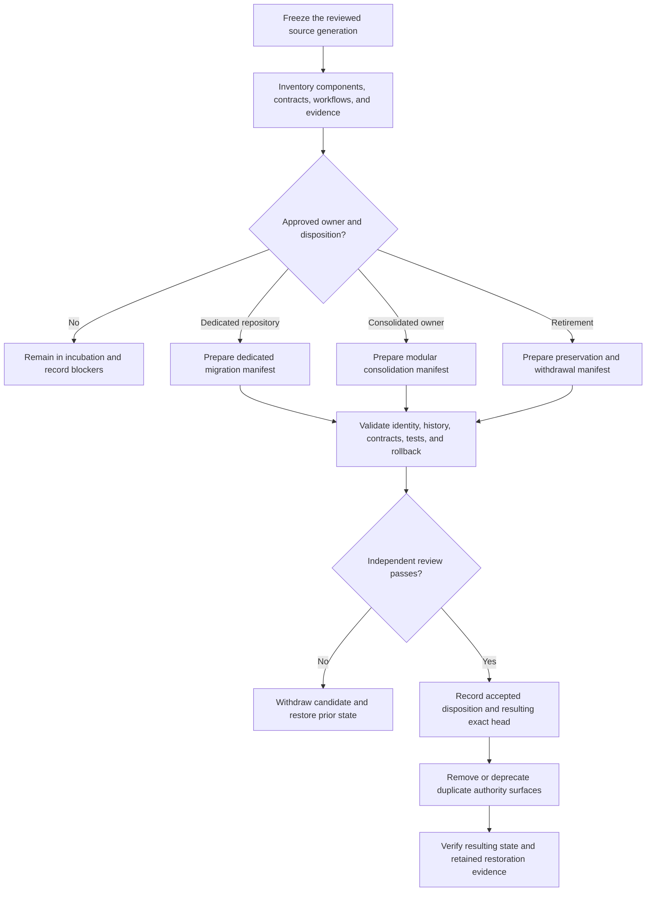

# Incubation exit and migration playbook

Status: `DOCUMENTED_NOT_APPROVED`

This guide defines how the XYZ / PhantomBlock prototype may leave the `Misc` incubation repository without losing history, widening authority, or allowing a documentation decision to masquerade as an operational approval. It is a review protocol only. It does not select a destination, approve consolidation, authorize retirement, publish software, transfer credentials, or activate any collector, adapter, service, or deployment path.

## Why this playbook exists

`Misc` is a temporary evidence-preservation surface, not a permanent product owner. A safe exit therefore has to preserve two things at once:

1. the useful source, tests, decisions, limitations, and provenance already accumulated; and
2. the authority boundaries that prevent an experimental prototype from becoming operational merely because it was copied, renamed, or documented.

A successful exit is not measured by moving files. It is measured by whether an independent reviewer can reconstruct what moved, what did not move, who owns each resulting contract, which claims remain unsupported, how duplicate authority was removed, and how the prior state can be restored.

## Allowed dispositions

Exactly one primary disposition must be approved for each retained component:

| Disposition | Meaning | Minimum approval evidence |
|---|---|---|
| `DEDICATED_MIGRATION` | Move the approved prototype subset and preserved history into a dedicated repository with an accepted charter. | Destination owner, source-to-target manifest, accepted contract boundaries, history map, validation plan, rollback plan. |
| `MODULAR_CONSOLIDATION` | Incorporate an approved subset into JusticeForMe or another named owner while preserving modular collector boundaries and both source histories. | Canonical envelope owner, field mapping, duplicate/conflict rules, module boundaries, retained source lineage, restoration path. |
| `EVIDENCE_PRESERVING_RETIREMENT` | Stop active development and retain source, decisions, limitations, and evidence for historical or forensic review. | Retirement owner, immutable archive identity, retention and access policy, withdrawal notice, restoration criteria. |
| `REMAIN_IN_INCUBATION` | Keep the prototype frozen in `Misc` because no safe disposition is yet approved. | Explicit review record stating unresolved blockers and the next decision date or condition. |

A component may be retired while another component is migrated, but every file, contract, workflow, artifact class, and authority surface must receive one explicit disposition. Silence is `REMAIN_IN_INCUBATION`, not approval.

## Decision flow



### Prose equivalent

The reviewer first freezes an exact source generation and inventories every component, workflow, contract, artifact class, and authority surface. If no owner and disposition are approved, the work remains frozen in `Misc`. If a dedicated migration, modular consolidation, or retirement is approved, the responsible parties prepare a manifest that preserves source identity and history while defining the destination or archive. An independent review then verifies identity, contracts, tests, privacy, security, and rollback. A failed review withdraws the candidate and restores the prior state. A passed review records the resulting exact head, removes or deprecates duplicate authority surfaces, and verifies that the resulting state and restoration evidence are complete.

The diagram and prose describe the same sequence. Neither constitutes approval.

## Required source freeze

Before preparing an exit candidate, record:

- source repository and immutable commit;
- branch and pull-request identity, if applicable;
- package, CLI, schema, configuration, workflow, documentation, and artifact identities;
- complete changed-file inventory relative to the accepted source generation;
- open issues, unresolved review findings, unsupported claims, and known defects;
- dependency, license, data-rights, firmware-source, PCAP, privacy, and retention classifications;
- the exact tests and workflows that passed, failed, were skipped, or did not run;
- artifact identifiers, hashes, expiration dates, and any missing evidence;
- all authority surfaces, including publication, credentials, networking, privileged collection, response, release, incident, revocation, and rollback.

A branch name, tag, copied directory, package version, or successful workflow is not a source freeze unless it is bound to an immutable commit and independently reviewable evidence.

## Component disposition ledger

The exit packet must classify at least these component classes:

| Component class | Required disposition questions |
|---|---|
| Collectors and parsers | Which source files move? Which platforms and inputs remain unsupported? Who owns validation and incident response? |
| Evidence and findings | What is the canonical envelope? Which fields are exact, transformed, deprecated, or rejected? Who owns correction and revocation? |
| Baselines and manifests | Who authenticates sources, applicability, updates, expiration, and withdrawal? |
| CLI, API, and dashboard | Which interfaces remain? Which are renamed or removed? How are non-authorizing review boundaries preserved? |
| Extensions | Which extension contracts survive? How are provenance, isolation, resource limits, and revocation handled? |
| Response adapters | Are they excluded, dry-run only, or separately authorized? Who owns capabilities, audit, rollback, and partial failure? |
| Packaging and images | Which build paths remain? What reproducibility, SBOM, signing, and withdrawal evidence is required? |
| Workflows and Pages | Which automation is retained? Which permissions are required? Who can publish, release, or change settings? |
| Tests and fixtures | Which tests transfer unchanged? Which require new canonical fixtures? How are duplicate and conflict cases preserved? |
| Documentation and decisions | Which claims remain current? Which are superseded? How are links, redirects, deprecation, and historical context preserved? |

## Source-to-target manifest

Every migration or consolidation must include a machine-readable manifest. The following example is deliberately non-executable and grants no authority:

```yaml
schema: misc.incubation-exit-manifest.v1
status: DOCUMENTED_NOT_APPROVED
source:
  repository: aevespers2/Misc
  commit: <immutable-source-commit>
  subtree: phantomblock/
  pull_request: <number-or-null>
disposition:
  type: DEDICATED_MIGRATION | MODULAR_CONSOLIDATION | EVIDENCE_PRESERVING_RETIREMENT
  decision_record: <approved-record-id>
  approved_by: []
target:
  repository: <owner/repository-or-archive-id>
  expected_base: <immutable-target-base>
  resulting_head: null
components:
  - source_path: <path>
    target_path: <path-or-null>
    disposition: MOVE | TRANSFORM | DEPRECATE | RETIRE | REJECT
    semantic_owner: <owner-or-VACANT>
    interface_owner: <owner-or-VACANT>
    notes: <losses-limitations-or-open-questions>
contracts:
  canonical_envelope: <accepted-contract-or-UNRESOLVED>
  device_identity: <accepted-contract-or-UNRESOLVED>
  baseline_identity: <accepted-contract-or-UNRESOLVED>
  correction_revocation: <accepted-contract-or-UNRESOLVED>
  privacy_retention: <accepted-contract-or-UNRESOLVED>
  incident_rollback: <accepted-contract-or-UNRESOLVED>
history:
  method: FULL_HISTORY | FILTERED_HISTORY_WITH_MAP | ARCHIVE_ONLY
  source_to_target_commit_map: <artifact-or-null>
  preserved_tags: []
validation:
  required_workflows: []
  required_fixtures: []
  independent_review: PENDING
rollback:
  prior_state: <immutable-source-and-target-state>
  restoration_procedure: <document-id>
  restoration_evidence: null
authority_denials:
  publication: true
  credentials: true
  privileged_collection: true
  network_access: true
  active_response: true
  release: true
  deployment: true
```

`authority_denials: true` means the manifest denies that authority. Any parser or reviewer must fail closed if the meaning is ambiguous.

## Identity and history preservation

A migration is unacceptable if it obscures provenance or creates the appearance that historical evidence was produced by the destination repository. The packet must preserve:

- the original repository, commit, author, timestamp, and file identity;
- the relationship between source commits and target commits;
- superseded, withdrawn, rejected, and corrected documentation states;
- prior workflow and artifact evidence as historical exact-generation evidence only;
- unresolved defects and review findings;
- third-party notices, licenses, data classifications, and source restrictions;
- a clear distinction between copied history, transformed content, and newly authored destination work.

Squashing, subtree extraction, or history filtering may be proposed only when an independently reviewable source-to-target map preserves the omitted context. Destructive source-history rewriting is outside this playbook.

## Contract and gluing review

The exit cannot be approved merely because each repository works locally. Reviewers must verify the composition edges:

1. device and baseline identity into the observation adapter;
2. PhantomBlock evidence into Repository `0` composition;
3. Repository `0` proposals into Repository `1` admission and capability review;
4. corrections, revocations, expiry, and incident freezes back to every consumer;
5. Bridge transport without trust creation;
6. QSO-STUDIO or AionUi presentation without approval or mutation authority;
7. JusticeForMe overlap without duplicate confidence inflation;
8. rollback and restored-state verification across every changed edge.

Required hostile fixtures include duplicate, independent corroboration, conflicting, partial, stale, replayed, wrong-device, wrong-baseline, malformed, privacy-downgraded, revoked, corrected, withdrawn, transport-modified, display-misinterpreted, and rollback-at-capacity cases.

A pairwise pass is insufficient when a three-party route changes meaning. At least one triple-overlap witness must cover each consequential route.

## Consolidation-specific controls

For modular consolidation with JusticeForMe or another owner:

- retain independently testable collector modules;
- define one canonical envelope and field vocabulary;
- designate exactly one semantic owner for each shared field;
- record whether each source observation is duplicate, corroborating, conflicting, partial, or independent;
- prevent shared implementation from becoming shared authority by implication;
- preserve source-specific limitations and confidence;
- retire or deprecate duplicate CLI, schema, workflow, Pages, and release surfaces after resulting-state validation;
- retain a restoration path to the pre-consolidation generations.

## Retirement-specific controls

Evidence-preserving retirement must include:

- immutable archive identity and content hashes;
- a final status and limitations statement;
- a public or restricted access classification;
- retention, legal-hold, privacy, and deletion rules;
- disabled publication, release, scheduled execution, credentials, and deployment paths;
- vulnerability-report and correction contacts for retained public artifacts;
- restoration criteria that do not silently reactivate operational authority;
- a deprecation notice for links, package names, schemas, and interfaces that consumers might still reference.

Retirement is not deletion. Deletion requires a separate records, privacy, legal, and provenance decision.

## Validation and acceptance evidence

A disposition candidate remains `DOCUMENTED_NOT_APPROVED` until all applicable evidence is retained at one exact resulting head:

- clean source and documentation builds;
- unit, integration, hostile-input, compatibility, and rollback tests;
- local and cross-repository schema/fixture validation;
- dependency and environment capture;
- SBOM, checksums, and source archive where applicable;
- link, navigation, accessibility, and claims-to-evidence review;
- license, data-rights, privacy, retention, and disclosure review;
- resolved ownership and authority matrix;
- independent review of the exact rendered documentation and resulting repository state;
- a successful restoration exercise or independently verified restoration plan.

Historical passing evidence may support review, but it cannot validate a changed descendant without explicit revalidation.

## Fail-closed stop conditions

Stop and retain the candidate as blocked if:

- the source or target generation is mutable or unclear;
- any component lacks a disposition;
- semantic, interface, security, privacy, incident, publication, release, or rollback ownership is vacant where required;
- copied history cannot be distinguished from target-authored work;
- duplicate authority surfaces remain active without an approved transition period;
- contract transformations are lossy, undocumented, or untested;
- a correction or revocation cannot reach every affected consumer;
- required credentials, proprietary firmware, sensitive PCAPs, or private findings lack an approved handling route;
- migration requires production deployment, infrastructure apply, credential rotation, or destructive history rewriting not separately authorized;
- rollback cannot restore the prior state or the restored state cannot be independently verified;
- documentation or workflow success is being treated as product, integration, release, or deployment approval.

## Reviewer onboarding sequence

1. Read the root `README.md`, `taskchain.md`, `release.md`, `punchlist.md`, and `changelog.md`.
2. Review [Repository boundaries](repository-boundaries.md), [Portable host-observation role](portable-host-observation.md), and [JusticeForMe overlap](host-observation-overlap.md).
3. Review [Obstruction and gluing analysis](obstruction-and-gluing.md) and identify all affected routes.
4. Verify the exact source freeze and component ledger.
5. Review the source-to-target manifest and every `VACANT`, `UNRESOLVED`, transformed, deprecated, rejected, or retired entry.
6. Confirm that the selected disposition is explicitly approved and that all alternatives remain preserved in the decision record.
7. Inspect exact-head validation, retained artifacts, accessibility evidence, and restoration evidence.
8. Approve, reject, or request correction without widening the authority described by the manifest.

## Capability map

This playbook exercises FYSA-120 capabilities without treating taxonomy membership as proof of competence:

- `011-B` and `011-E`: accessible decision diagrams, prose equivalence, and cross-modal consistency;
- `012-A`, `012-B`, `012-C`, `012-D`, and `012-E`: document architecture, decision records, operational playbooks, quality controls, and lifecycle synchronization;
- `017-C`, `017-D`, and `017-E`: source-to-target provenance, version-substitution detection, preservation, and correction propagation;
- `018-B`, `018-D`, and `018-E`: records classification, onboarding transfer, responsibility mapping, and contested-history preservation;
- `019-B`, `019-C`, and `019-D`: plain-language, accessible, and uncertainty-aware risk communication;
- `031-A`, `031-D`, and `031-E`: contract acceptance criteria, hostile validation, and assurance maintenance;
- `040-A` through `040-E`: system archaeology, migration-risk mapping, preservation, compatibility design, rollback, and continuity assurance.

Proposed non-authoritative refinement:

**`040-P — Incubation exit, authority-neutral migration, modular consolidation, and evidence-preserving retirement`.**

The proposed subdivision would cover component-level disposition ledgers, source-to-target commit maps, duplicate-authority retirement, exact-head rebinding, restoration witnesses, and withdrawal propagation for experimental work leaving an incubation repository.

## Current disposition

No exit path has been selected. The current governing state remains:

`INCUBATION_EXIT_DOCUMENTED_DISPOSITION_UNAPPROVED`

Until an approved decision and complete evidence package exist, PhantomBlock remains frozen in `Misc`, unreleased, unpublished, non-operational, and without privileged authority.
