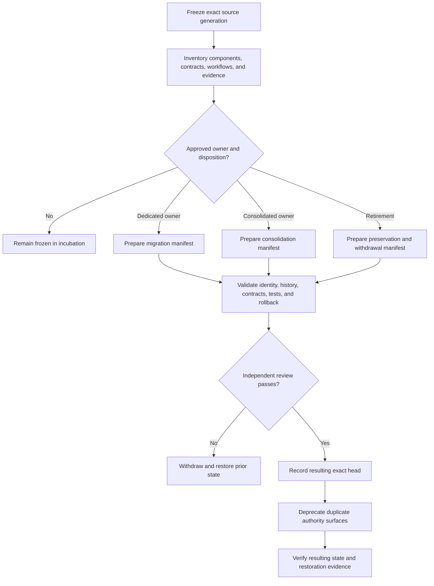

# Incubation exit and migration playbook

Status: `DOCUMENTED_NOT_APPROVED`

This guide defines how the XYZ / PhantomBlock prototype may leave `Misc` without losing history, widening authority, or allowing file movement to masquerade as product approval. It is a review protocol only. It does not select a destination, approve consolidation or retirement, publish software, transfer credentials, activate collectors, or authorize release or deployment.

## Controlled dispositions

Every retained component must receive exactly one disposition:

| Disposition | Meaning | Minimum evidence |
|---|---|---|
| `DEDICATED_MIGRATION` | Move an approved subset into a dedicated repository with an accepted charter. | Destination owner, source-to-target manifest, history map, contract owners, validation and rollback plan. |
| `MODULAR_CONSOLIDATION` | Incorporate an approved module into JusticeForMe or another named owner while preserving modular boundaries and both histories. | Canonical envelope, field mapping, duplicate/conflict rules, module ownership, restoration path. |
| `EVIDENCE_PRESERVING_RETIREMENT` | Stop active development while preserving source, decisions, limitations, and evidence. | Archive identity, retention/access policy, withdrawal notice, restoration criteria. |
| `REMAIN_IN_INCUBATION` | Keep the prototype frozen because no safe exit is approved. | Explicit blocker record and reopening condition. |

Silence is `REMAIN_IN_INCUBATION`, not approval.

## Decision flow



**Equivalent prose:** First freeze an immutable source generation and inventory every component, contract, workflow, evidence class, and authority surface. If no owner and disposition are approved, the prototype remains frozen in `Misc`. For an approved migration, consolidation, or retirement, prepare a manifest that preserves source identity and history. Independent review then verifies contracts, tests, privacy, security, rollback, and restoration. Failure withdraws the candidate and restores the prior state. Success records the resulting exact head, deprecates duplicate authority surfaces, and verifies the resulting and restorable states.

## Required source freeze

Record:

- source repository, immutable commit, branch, and pull-request identity;
- package, CLI, schema, workflow, documentation, and artifact identities;
- changed-file inventory and open defects;
- dependency, license, firmware, PCAP, privacy, retention, and disclosure classifications;
- tests and workflows that passed, failed, were skipped, or did not run;
- artifact identifiers, hashes, expiration dates, and missing evidence;
- publication, credentials, networking, privileged collection, response, release, incident, revocation, and rollback authority surfaces.

A branch name, tag, package version, or passing workflow is not a source freeze unless it is bound to an immutable commit and independently reviewable evidence.

## Component disposition ledger

The packet must classify at least:

- collectors and parsers;
- evidence, findings, and canonical fields;
- baselines and manifests;
- CLI, API, and dashboard interfaces;
- extensions and response adapters;
- packages, images, workflows, and Pages;
- tests, fixtures, documentation, and decision records.

For each item record the source path, target path or archive identity, disposition, semantic owner, interface owner, transformation or loss, unsupported states, and rollback route.

## Non-executable manifest template

```yaml
schema: misc.incubation-exit-manifest.v1
status: DOCUMENTED_NOT_APPROVED
source:
  repository: aevespers2/Misc
  commit: <immutable-source-commit>
  subtree: phantomblock/
disposition:
  type: DEDICATED_MIGRATION | MODULAR_CONSOLIDATION | EVIDENCE_PRESERVING_RETIREMENT
  decision_record: <approved-record-id>
  approved_by: []
target:
  repository_or_archive: <identity>
  expected_base: <immutable-base-or-null>
  resulting_head: null
components:
  - source_path: <path>
    target_path: <path-or-null>
    disposition: MOVE | TRANSFORM | DEPRECATE | RETIRE | REJECT
    semantic_owner: <owner-or-VACANT>
    interface_owner: <owner-or-VACANT>
    notes: <limitations-or-losses>
history:
  method: FULL_HISTORY | FILTERED_HISTORY_WITH_MAP | ARCHIVE_ONLY
  source_to_target_commit_map: <artifact-or-null>
contracts:
  canonical_envelope: <accepted-contract-or-UNRESOLVED>
  device_identity: <accepted-contract-or-UNRESOLVED>
  baseline_identity: <accepted-contract-or-UNRESOLVED>
  correction_revocation: <accepted-contract-or-UNRESOLVED>
  privacy_retention: <accepted-contract-or-UNRESOLVED>
  incident_rollback: <accepted-contract-or-UNRESOLVED>
validation:
  required_workflows: []
  required_fixtures: []
  independent_review: PENDING
rollback:
  prior_state: <immutable-source-and-target-state>
  restoration_procedure: <document-id>
  restoration_evidence: null
authority_denials:
  publication: true
  credentials: true
  privileged_collection: true
  network_access: true
  active_response: true
  release: true
  deployment: true
```

`authority_denials: true` means that authority is denied. Ambiguity fails closed.

## History and provenance

The exit packet must preserve original repository, commit, author, timestamp, file identity, source-to-target commit relationships, superseded and withdrawn states, unresolved findings, licenses, data classifications, and historical workflow evidence as exact-generation evidence only. Copied history must remain distinguishable from destination-authored work.

Squashing, subtree extraction, or history filtering may be proposed only with an independently reviewable source-to-target map. Destructive source-history rewriting is outside this playbook.

## Contract and gluing review

Local repository success is insufficient. Reviewers must verify:

1. device and baseline identity into PhantomBlock;
2. PhantomBlock evidence into Repository `0`;
3. Repository `0` proposals into Repository `1`;
4. correction, revocation, expiry, and incident propagation to every consumer;
5. Bridge transport without trust creation;
6. QSO-STUDIO or AionUi display without approval or mutation authority;
7. JusticeForMe overlap without duplicate-confidence inflation;
8. rollback and restored-state verification across every changed edge.

Hostile fixtures must include duplicate, independent-corroboration, conflicting, partial, stale, replayed, wrong-device, wrong-baseline, malformed, privacy-downgraded, revoked, corrected, withdrawn, transport-modified, display-misinterpreted, and rollback-at-capacity cases. Pairwise passes do not replace triple-overlap witnesses where a three-party route can change meaning.

## Consolidation controls

Modular consolidation must preserve independently testable collector modules, one canonical envelope and field vocabulary, one semantic owner per shared field, deterministic duplicate/conflict classification, source-specific limitations, deprecation of duplicate CLI/schema/workflow/Pages/release surfaces, and restoration to the pre-consolidation generations.

## Retirement controls

Evidence-preserving retirement requires an immutable archive identity and hashes, final limitations statement, access classification, retention and privacy rules, disabled publication/release/scheduled execution/credentials/deployment paths, correction contact, deprecation notices, and restoration criteria that do not silently reactivate authority. Retirement is not deletion.

## Validation and stop conditions

A candidate remains `DOCUMENTED_NOT_APPROVED` until one exact resulting head retains applicable source and documentation builds, tests, hostile fixtures, contract validation, environment capture, SBOM/checksums where applicable, link and accessibility review, rights/privacy review, ownership matrix, independent rendered-artifact review, and restoration evidence.

Stop if source or target identity is unclear; a component lacks a disposition; required ownership is vacant; copied history is ambiguous; duplicate authority remains active; transformations are lossy or untested; corrections or revocations cannot propagate; sensitive inputs lack an approved route; migration requires unauthorized deployment, credentials, infrastructure, or destructive history rewriting; or rollback/restoration cannot be verified.

## Reviewer onboarding

1. Read the repository README, `taskchain.md`, `release.md`, `punchlist.md`, and `changelog.md`.
2. Review [Incubation Status](incubation-status.md), [Architecture and Trust Boundaries](architecture.md), and the [Threat Model](threat-model.md).
3. Verify the exact source freeze and component ledger.
4. Inspect every `VACANT`, `UNRESOLVED`, transformed, deprecated, rejected, or retired entry.
5. Confirm explicit disposition approval and preserved alternatives.
6. Inspect exact-head validation, accessibility evidence, rollback, and restoration.
7. Approve, reject, or request correction without widening authority.

## FYSA-120 capability map

- `011-B`, `011-E`: accessible diagrams and prose equivalence;
- `012-A` through `012-E`: information architecture, decision writing, operational playbooks, quality controls, and lifecycle synchronization;
- `017-C` through `017-E`: provenance, substitution detection, preservation, and correction propagation;
- `018-B`, `018-D`, `018-E`: records classification, onboarding, responsibility mapping, and contested-history preservation;
- `019-B` through `019-D`: plain-language, accessibility, and risk communication;
- `031-A`, `031-D`, `031-E`: acceptance criteria, hostile validation, and assurance maintenance;
- `040-A` through `040-E`: system archaeology, migration risk, preservation, compatibility, rollback, and continuity.

Proposed non-authoritative refinement:

**`040-P — Incubation exit, authority-neutral migration, modular consolidation, and evidence-preserving retirement`.**

## Current disposition

`INCUBATION_EXIT_DOCUMENTED_DISPOSITION_UNAPPROVED`

No exit path has been selected. PhantomBlock remains preserved, unreleased, unpublished, non-operational, and without privileged authority.
