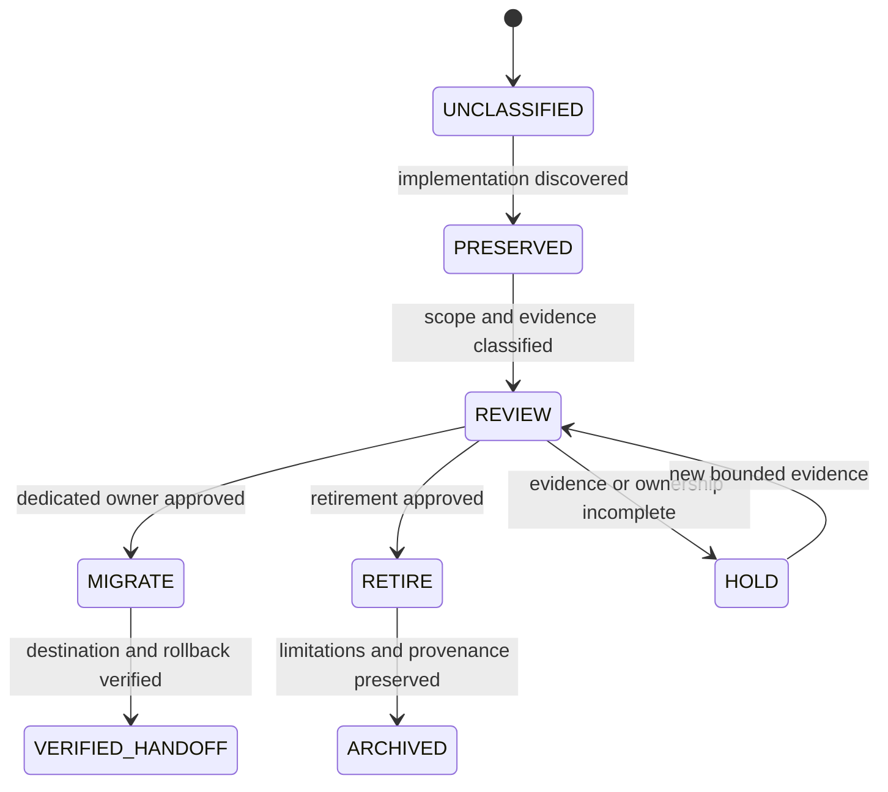

# Incubation Status and Evidence Boundary

Status: **holding repository; prototype preserved; release and deployment blocked**

XYZ / PhantomBlock exists in `Misc` because implementation arrived before the portfolio had approved a permanent owner, product boundary, evidence standard, license, publication posture, or retirement path. The correct response is to preserve the work and its history while preventing documentation, workflows, package metadata, or local tests from silently promoting it into an accepted product.

## What the repository currently proves

The repository proves that source code, tests, packaging definitions, documentation, a manual Pages workflow, and a prior lint/test run exist. Those facts establish an implemented prototype shape only.

They do **not** prove:

- comprehensive firmware or implant detection;
- representative hardware support;
- trusted-baseline correctness;
- false-positive or false-negative rates;
- safe production isolation;
- approved use of credentials or management interfaces;
- certification, CMMC status, STIG approval, Army authorization, or an Authority to Operate;
- release, deployment, or publication approval.

## Evidence classes

| Class | Meaning | Example |
|---|---|---|
| Preserved implementation | Source or configuration exists | CLI, collectors, report service, packaging definitions |
| Configured automation | A workflow is present | CI or manual Pages workflow |
| Local or historical validation | A bounded check previously passed | Prior lint/test workflow at a historical head |
| Proposed capability | Documentation describes intended behavior | Signed evidence bundles or future integrations |
| Missing accepted evidence | Required proof is absent | Hardware matrix, accuracy study, rollback drill |
| Blocked authority | A decision or permission has not been granted | Release, publication, operational use |

## Incubation lifecycle

**Equivalent prose:** Work begins unclassified. When implementation is discovered, it is preserved. Review classifies its scope and evidence. The Architect may approve migration to a dedicated owner, retirement with provenance, or continued hold. A hold returns to review only when new bounded evidence exists. Migration is incomplete until the destination and rollback are verified; retirement is incomplete until the archive preserves limitations and provenance.

## Source precedence

1. Exact source files and immutable commits establish what exists.
2. Retained workflow artifacts establish only the checks they actually contain.
3. `taskchain.md`, `release.md`, `punchlist.md`, and `changelog.md` establish the current planning and release posture.
4. Product documentation explains intended use but cannot override missing evidence or blocked authority.
5. Marketing language, package versions, compliance mappings, and configured workflows cannot create acceptance.

## Controlled changes while held

Permitted bounded work includes:

- documentation correction and accessibility;
- evidence classification and manifests;
- reproducibility and non-deploying validation;
- threat modeling and privacy review;
- ownership, migration, retirement, and rollback planning;
- synthetic malformed-input and negative fixtures.

Blocked work includes feature expansion, production adapters, privileged mutation, credential acquisition, public release, automatic publication, certification claims, or operational integration.

## Decision needed

An Architect must select one of three dispositions:

1. **Migrate** — identify a dedicated repository, owner, scope, license path, evidence plan, compatibility window, and rollback route.
2. **Retire** — preserve source identity, history, findings, limitations, and a clear non-current notice.
3. **Hold** — record the missing evidence or ownership conditions and prohibit capability expansion until they are resolved.

No option is selected by this page.
