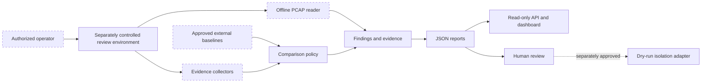

# XYZ / PhantomBlock Prototype

## Documentation status

XYZ is an **implemented but unaccepted defensive research prototype** preserved inside the `Misc` incubation repository. The source tree contains collection, reporting, extension, packaging, test, and documentation artifacts; those artifacts do not by themselves establish a supported product, validated detector, release candidate, certification, deployment authorization, or permission to assess systems.

The authoritative repository posture is defined by the root-level records `taskchain.md`, `release.md`, `punchlist.md`, and `changelog.md`. Those files intentionally remain outside the MkDocs `docs_dir`; review them directly in the repository before changing this prototype. Where older prototype language sounds more mature than the retained evidence, those planning records control.

Current incubation-exit status: `INCUBATION_EXIT_DOCUMENTED_DISPOSITION_UNAPPROVED`.

!!! warning "Release and publication are blocked"
    Ownership, product definition, licensing, trusted-baseline governance, representative validation, security review, provenance, rollback, publication, and explicit approval remain unresolved. The Pages workflow is manual-only and fails closed unless `release.md` is explicitly marked `READY`.

## What exists today

The `phantomblock/` subtree currently includes:

- a Python 3.11+ package and `xyz` / `phantomblock` command entry points;
- hardware, firmware, kernel, and management-plane evidence collection;
- optional comparison against a supplied firmware manifest;
- offline PCAP inspection;
- JSON reporting, a FastAPI service, and a simple dashboard;
- a passive extension registry;
- a dry-run switch-isolation adapter seam;
- unit tests, Ruff configuration, CI, build definitions, and documentation.

These items are classified as **implemented prototype artifacts**. Their presence does not establish that they are safe, complete, representative, reproducible across environments, or approved for operational use.

## Intended research question

The prototype explores whether a defender can gather and organize below-OS and out-of-band evidence from a separately controlled environment while keeping collection, interpretation, and disruptive response as distinct trust boundaries.

The working design emphasizes:

1. evidence before conclusions;
2. conservative classification;
3. independently governed baselines;
4. passive and read-only defaults;
5. explicit authorization;
6. dry-run-first response integration;
7. retained machine-readable provenance;
8. clear separation between implemented behavior and future design intent.

## Architecture at a glance

The diagram describes the intended separation of responsibilities. It does not assert that every boundary has been independently validated.

## Evidence classification

| Classification | Meaning | Current examples |
|---|---|---|
| Implemented | Source or configuration exists in the repository. | CLI, collectors, PCAP inspection, dashboard, extension registry, dry-run adapter. |
| Configured | A workflow or build path is described but may not have accepted run evidence. | CI, live-image definition, standalone build, SBOM generation, Pages workflow. |
| Exact-generation evidence | A retained run demonstrates bounded behavior at one immutable commit only. | PhantomBlock CI evidence recorded in `release.md` and the active pull request. |
| Proposed | Documentation describes a future or conditional capability. | Signed evidence bundles, production adapters, broad hardware support, formal authorization exports. |
| Accepted evidence | Independently reviewed results tied to an immutable approved candidate. | None sufficient for release at present. |

## Safe documentation path

- Start with [Repository boundaries](repository-boundaries.md).
- Review [Architecture](architecture.md) and [Design contracts](design-contracts.md).
- Read the [Portable host-observation role](portable-host-observation.md), [JusticeForMe overlap](host-observation-overlap.md), and [Obstruction and gluing analysis](obstruction-and-gluing.md).
- Use the [Incubation exit and migration playbook](incubation-exit-and-migration.md) to review dedicated migration, modular consolidation, retirement, or continued-incubation options without granting authority.
- Use [Developer onboarding](developer-onboarding.md) for passive local setup.
- Read [Threat model](threat-model.md) before handling firmware, PCAPs, extensions, credentials, or privileged interfaces.
- Consult [Validation roadmap](validation.md) for the evidence required before claims can mature.
- Review [Ownership and release](ownership-and-release.md) for the architectural decision that blocks promotion.

## Explicit non-goals

The prototype is not an offensive framework, credential-bypass mechanism, firmware-flashing utility, universal malware detector, autonomous remediation service, production switch controller, certification package, or substitute for vendor and laboratory analysis. It must not be used against systems without explicit authorization.

## Current decision boundary

No additional capability, package promotion, public deployment, or operational claim should proceed in `Misc`. The next decision is architectural: migrate the approved subset into a dedicated owner, consolidate an approved module with JusticeForMe, retire/archive the prototype with evidence preserved, or explicitly retain it frozen in incubation. The exit playbook defines the required manifest, source-history map, contract review, validation, rollback, and restoration evidence; it does not select a disposition.
