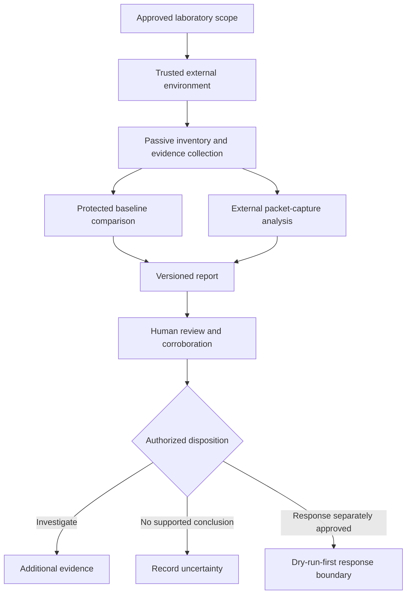

# XYZ / PhantomBlock

## Preserved defensive research prototype

XYZ is an implemented prototype for defensive firmware-integrity, hardware-anomaly, and external network-evidence assessment. It is preserved inside the portfolio’s `Misc` incubation repository while ownership, licensing, validation, publication, migration, consolidation, retirement, and rollback decisions remain unresolved.

**Current status:** prototype code and documentation exist; release, deployment, certification, and operational authority are blocked.

**Incubation-exit status:** `INCUBATION_EXIT_DOCUMENTED_DISPOSITION_UNAPPROVED`.

**File-disposition status:** `FILE_DISPOSITION_MANIFEST_COMPLETE_FOR_FROZEN_SOURCE_DECISION_UNAPPROVED`.

## Choose a route

- New reviewer: read [Incubation Status](incubation-status.md).
- Component reviewer: inspect the [Component and Portfolio Overlap Inventory](component-overlap-inventory.md).
- File-manifest reviewer: inspect the [Exact File-level Evidence and Disposition Manifest](file-disposition-manifest.md) and its [machine-readable companion](file-disposition-manifest-v1.json).
- Architecture or disposition reviewer: inspect [Architecture and Trust Boundaries](architecture.md), the [Threat Model](threat-model.md), and the [Incubation Exit and Migration Playbook](incubation-exit-and-migration.md).
- New contributor: begin with [Safe Onboarding](onboarding.md).
- Developer: follow the [Developer Guide](developer-guide.md) and [Validation Roadmap](validation.md).
- Release or publication reviewer: read the repository-level `release.md` and `punchlist.md` before considering any workflow or artifact.

## Intended defensive use

The prototype explores evidence collection and conservative assessment for authorized defenders investigating possible persistence or covert communication involving:

- BIOS and UEFI firmware;
- network-interface firmware;
- baseboard management controllers;
- AMT, IPMI, Redfish, and related management planes;
- storage controllers and SSD firmware;
- chipset and PCI-device anomalies;
- kernel hooks, unsigned modules, taint, or suspicious low-level indicators;
- traffic observed outside the target operating system.

These are research targets, not a supported-platform or detection-coverage claim.

## Evidence before conclusions

XYZ must not label a system compromised from one mismatch, open port, or heuristic. Collection records observations; policy assigns conservative severity; human review and corroborating evidence determine any conclusion. A clean local test run cannot establish trusted firmware, detection accuracy, safe isolation, or operational readiness.

## Conceptual workflow

**Equivalent prose:** Work begins only within an approved laboratory scope and a trusted environment outside the target operating system. Passive inventory and evidence collection may feed protected-baseline comparison and external packet analysis. Both produce a versioned report for human review and corroboration. The reviewer may request more evidence, record that no supported conclusion exists, or—under separate authorization—enter a dry-run-first response process.

## Safety boundary

XYZ does not authorize exploitation, authentication bypass, firmware flashing, production isolation, unrestricted scanning, or use against third-party systems. Disruptive integrations remain separate from passive collection and require explicit approval, authentication, allowlists, auditability, idempotency, and verified rollback.

Do not publish credentials, customer data, proprietary firmware, sensitive packet captures, private findings, or production evidence in Git, CI, Pages, issues, or public artifacts.

## What is now verified as documentation evidence

The frozen source `68703e138ffa1df26924dd4e018078a246531ace` has a 42-path manifest recording exact Git blob identities, component/evidence/sensitivity classes, limitations, owner vacancies, a fail-closed incubation disposition, correction route, and rollback treatment. The manifest files themselves are explicitly excluded to avoid a self-referential digest and any descendant source requires a new binding.

## What remains unresolved

- permanent repository and owner;
- dedicated migration, modular consolidation, evidence-preserving retirement, or continued-hold decision;
- Architect-approved per-path dispositions and source-to-target history map;
- canonical envelope and cross-repository contract ownership;
- license and third-party data rights;
- exact supported and unsupported platform matrix;
- trusted-baseline governance and key custody;
- representative and adversarial validation;
- false-positive and false-negative characterization;
- privacy, security, disclosure, retention, correction, revocation, and incident procedures;
- package, image, Pages, and release approval;
- rollback and restored-state evidence.

The repository does not claim certification, CMMC status, STIG approval, Army authorization, or an Authority to Operate.
