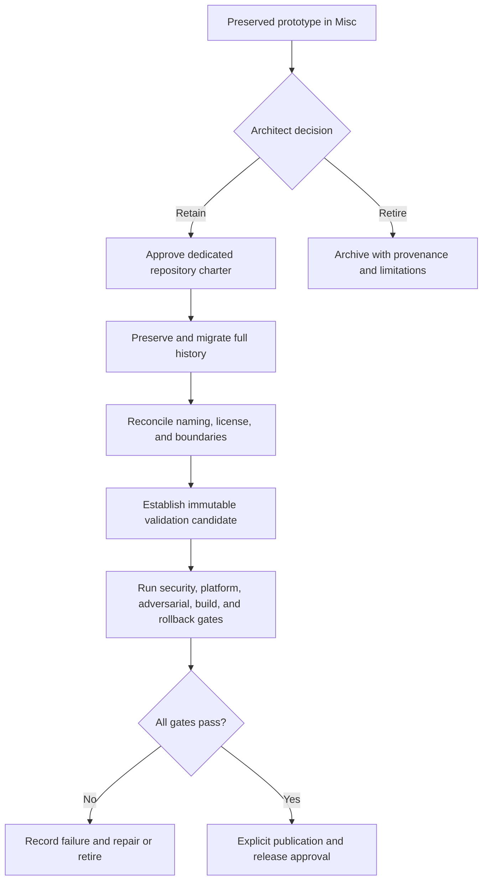
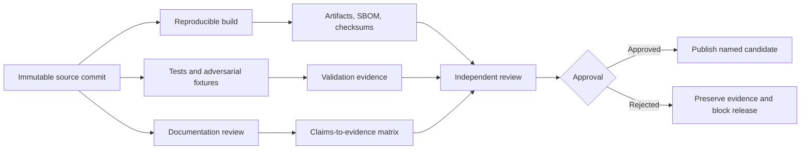

# Ownership and Release Decision

## Decision required

XYZ / PhantomBlock cannot become release-ready while it remains inside `Misc`. The next architectural decision is binary:

1. **Promote and migrate** the prototype into a dedicated repository with an approved charter; or
2. **Retire and archive** it while preserving source history, evidence, limitations, and the reason for disposition.

No third path should allow `Misc` to become the permanent production owner by default.

## Why ownership precedes release

A privileged defensive assessment tool needs durable answers to questions that an incubation repository cannot resolve informally:

- Who is accountable for security and vulnerability response?
- Which systems and users are supported?
- Who governs trusted firmware and device baselines?
- What data may be collected, retained, transmitted, or published?
- Which credentials and privileges are permitted?
- Who approves extensions and response adapters?
- Which package, CLI, API, schema, and version identifiers are canonical?
- Which organization may sign, publish, deploy, withdraw, or deprecate artifacts?
- What evidence is required before capability claims are allowed?

Without a dedicated owner, release controls would be ambiguous even if the code compiled and tests passed.

## Promotion path

## Required promotion record

The promotion decision should identify:

| Area | Required decision |
|---|---|
| Canonical identity | Repository name, package name, CLI name, product name, and version lineage. |
| Ownership | Maintainer, security contact, release authority, publication authority, and support boundary. |
| Intended users | Authorized laboratories, researchers, operators, or other explicitly defined groups. |
| Authorized use | Systems, environments, collection methods, credentials, network access, and prohibited uses. |
| Scope | Approved collectors, comparison logic, reporting, extension model, and response boundary. |
| Platforms | Supported and unsupported hardware, firmware, operating systems, interfaces, and capture formats. |
| Data | Firmware, PCAP, report, identifier, credential, retention, privacy, and disclosure policies. |
| Baselines | Sources, approvals, digest policy, revocation, redistribution rights, and update authority. |
| Security | Threat model, privilege model, extension isolation, dashboard exposure, and incident response. |
| Validation | Positive, negative, adversarial, malformed, unsupported, performance, and rollback fixtures. |
| Release | Candidate process, CI, artifacts, SBOM, checksums, signatures, provenance, approvals, and withdrawal. |
| Migration | Commit-history preservation, open issues, known defects, compatibility policy, and redirect/archive plan. |

## Release evidence model

A future candidate should be tied to one immutable commit and one explicit supported matrix.

A workflow definition, package version, MkDocs site, or prior successful test run is not a release candidate by itself.

## Promotion gates

The following gates remain blocking until evidence is recorded in the dedicated repository:

- approved charter and ownership;
- intended-user and authorized-use policy;
- license and third-party rights;
- repository overlap disposition;
- trusted-baseline governance;
- supported-platform matrix;
- clean-environment build and complete test reproduction;
- representative hardware and negative/adversarial validation;
- false-positive and false-negative characterization;
- parser and extension security review;
- credential, privilege, network, dashboard, and data protections;
- isolation rollback verification if active response is retained;
- SBOM, checksums, vulnerability review, and signed provenance;
- publication, support, incident-response, withdrawal, and deprecation plans;
- explicit release approval.

## Retirement path

Retirement is a valid architectural outcome when overlap, risk, licensing, unsupported claims, maintenance cost, or lack of a qualified owner outweighs the prototype's value.

A retirement record should preserve:

- final source commit and repository history;
- reason for retirement;
- implemented and proposed capability inventory;
- known defects and unsupported assumptions;
- security and privacy concerns;
- test and workflow evidence;
- dependency and license status;
- public-documentation disposition;
- instructions preventing accidental package or Pages publication;
- any concepts that may be reconsidered elsewhere without importing unsupported claims.

## Current posture

Until promotion or retirement is approved:

- `Misc` remains the canonical location only for preserved incubation evidence;
- XYZ remains unreleased;
- package version `0.3.0` remains prototype metadata;
- GitHub Pages remains manual-only and fail-closed;
- feature, packaging, deployment, and operational expansion remain frozen;
- documentation may clarify boundaries, evidence, reproduction, and decision requirements.