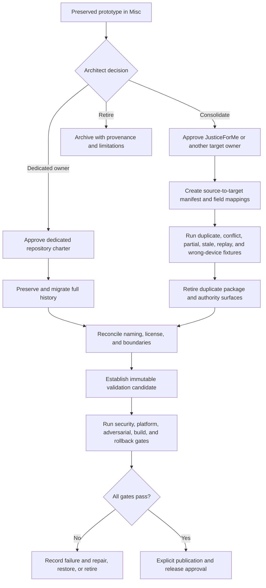
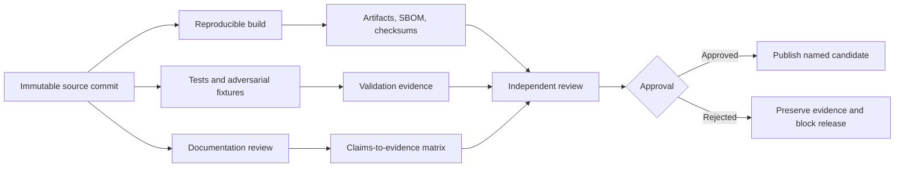

# Ownership and Release Decision

## Decision required

XYZ / PhantomBlock cannot become release-ready while it remains an indefinitely owned production component inside `Misc`. The next architectural decision has three bounded outcomes:

1. **Promote and migrate** the prototype into a dedicated repository with an approved charter;
2. **Consolidate compatible modules into JusticeForMe** or another explicitly approved host-observation owner, with field mappings, provenance, compatibility fixtures, and retirement of duplicate authority; or
3. **Retire and archive** the prototype while preserving source history, evidence, limitations, and the reason for disposition.

No fourth path should allow `Misc` to become the permanent production owner by default. Consolidation is not an informal code copy: it requires an approved owner, an explicit source-to-target manifest, conflict and deduplication semantics, compatibility evidence, and a rollback or restoration plan.

## Why ownership precedes release

A privileged defensive assessment tool needs durable answers to questions that an incubation repository cannot resolve informally:

- Who is accountable for security and vulnerability response?
- Which systems and users are supported?
- Who governs trusted firmware and device baselines?
- What data may be collected, retained, transmitted, or published?
- Which credentials and privileges are permitted?
- Who approves extensions and response adapters?
- Which package, CLI, API, schema, and version identifiers are canonical?
- Which organization may sign, publish, deploy, withdraw, or deprecate artifacts?
- What evidence is required before capability claims are allowed?

Without a dedicated or explicitly consolidated owner, release controls would be ambiguous even if the code compiled and tests passed.

## Disposition paths

**Diagram alternative:** The preserved prototype may be promoted into a dedicated repository, consolidated into an approved owner such as JusticeForMe, or retired. Dedicated promotion preserves and migrates history. Consolidation additionally requires a source-to-target manifest, semantic field mappings, duplicate and conflict fixtures, and retirement of duplicate package or authority surfaces. Both active paths then pass naming, licensing, security, validation, build, rollback, and explicit approval gates. Failure is preserved and leads to repair, restoration, or retirement rather than implicit release.

## Required disposition record

The architectural decision should identify:

| Area | Required decision |
|---|---|
| Disposition | Dedicated promotion, approved modular consolidation, or evidence-preserving retirement. |
| Canonical identity | Repository name, package name, CLI name, product name, and version lineage. |
| Ownership | Maintainer, security contact, release authority, publication authority, and support boundary. |
| Intended users | Authorized laboratories, researchers, operators, or other explicitly defined groups. |
| Authorized use | Systems, environments, collection methods, credentials, network access, and prohibited uses. |
| Scope | Approved collectors, comparison logic, reporting, extension model, and response boundary. |
| Platforms | Supported and unsupported hardware, firmware, operating systems, interfaces, and capture formats. |
| Data | Firmware, PCAP, report, identifier, credential, retention, privacy, and disclosure policies. |
| Baselines | Sources, approvals, digest policy, revocation, redistribution rights, and update authority. |
| Security | Threat model, privilege model, extension isolation, dashboard exposure, and incident response. |
| Validation | Positive, negative, adversarial, malformed, unsupported, performance, and rollback fixtures. |
| Release | Candidate process, CI, artifacts, SBOM, checksums, signatures, provenance, approvals, and withdrawal. |
| Migration | Commit-history preservation, open issues, known defects, compatibility policy, and redirect/archive plan. |
| Consolidation | Target owner, imported modules, rejected modules, field mappings, provenance links, duplicate/conflict rules, compatibility window, source retirement, and restoration path. |

## Dedicated promotion path

Dedicated promotion is appropriate only when PhantomBlock has a distinct durable role that cannot be represented cleanly as a module or profile beneath another approved host-observation owner. The new repository must receive the full provenance and release controls listed below; moving code alone does not establish ownership or authority.

## Consolidation path

Consolidation is appropriate when JusticeForMe or another approved project can own the useful observation capability without preserving a second package, schema, release, or authority surface.

The consolidation record must:

- pin the exact source and target commits;
- list every imported, translated, rejected, and retired module;
- preserve original authorship, license, issues, limitations, and validation evidence;
- map device identity, check identity, result state, completion state, evidence references, timestamps, freshness, privacy, and artifact digests into the target contract;
- define duplicate and conflict handling when both collectors observe the same host property;
- preserve `UNKNOWN`, unsupported, partial, stale, and unverifiable states rather than converting them into success;
- prove wrong-device, wrong-environment, replay, stale, partial-collection, duplicate, conflicting-observation, correction, revocation, and rollback behavior;
- retire or archive duplicate package, CLI, schema, Pages, release, and authority claims after the compatibility window;
- provide a tested restoration path if the consolidation loses required evidence or behavior.

Consolidation does not allow JusticeForMe, PhantomBlock, Repository `0`, or Repository `1` to self-approve the shared contract or operational authority.

## Release evidence model

A future candidate should be tied to one immutable commit and one explicit supported matrix.

A workflow definition, package version, MkDocs site, prior successful test run, or successful consolidation fixture is not a release candidate by itself.

## Promotion or consolidation gates

The following gates remain blocking until evidence is recorded in the approved owner repository:

- approved charter, disposition, and ownership;
- intended-user and authorized-use policy;
- license and third-party rights;
- repository overlap disposition;
- trusted-baseline governance;
- supported-platform matrix;
- clean-environment build and complete test reproduction;
- representative hardware and negative/adversarial validation;
- false-positive and false-negative characterization;
- parser and extension security review;
- credential, privilege, network, dashboard, and data protections;
- isolation rollback verification if active response is retained;
- source-to-target manifest and semantic compatibility fixtures for consolidation;
- explicit duplicate, conflict, correction, revocation, and stale-evidence handling;
- SBOM, checksums, vulnerability review, and signed provenance;
- publication, support, incident-response, withdrawal, and deprecation plans;
- explicit release approval.

## Retirement path

Retirement is a valid architectural outcome when overlap, risk, licensing, unsupported claims, maintenance cost, failed consolidation, or lack of a qualified owner outweighs the prototype's value.

A retirement record should preserve:

- final source commit and repository history;
- reason for retirement;
- implemented and proposed capability inventory;
- known defects and unsupported assumptions;
- security and privacy concerns;
- test and workflow evidence;
- dependency and license status;
- public-documentation disposition;
- instructions preventing accidental package or Pages publication;
- any concepts that may be reconsidered elsewhere without importing unsupported claims.

## Current posture

Until dedicated promotion, approved modular consolidation, or retirement is approved:

- `Misc` remains the canonical location only for preserved incubation evidence;
- XYZ remains unreleased;
- package version `0.3.0` remains prototype metadata;
- GitHub Pages remains manual-only and fail-closed;
- feature, packaging, deployment, and operational expansion remain frozen;
- documentation may clarify boundaries, evidence, reproduction, consolidation, and decision requirements.
