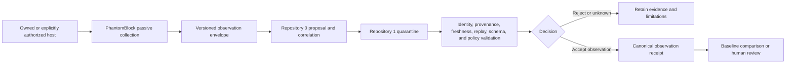

# Portable Host-Observation Role

## Portfolio placement

XYZ / PhantomBlock is best understood as a **candidate passive host-observation adapter** for the portable first-install security foundation formed by Repository `0` and Repository `1`.

It is not a replacement for either repository:

- Repository `0` owns bootstrap orchestration, inventory planning, proposal construction, bounded execution, verification, and maintenance workflows.
- Repository `1` owns the candidate canonical device baseline, capability decisions, revocations, authoritative receipts, checkpoints, and recovery state.
- PhantomBlock may supply a bounded observation section covering hardware, firmware, kernel, management-plane, and offline network evidence when its owner, platform support, schemas, privacy rules, and validation are approved.

Until those decisions are made, PhantomBlock remains an unaccepted prototype in `Misc` and must not be treated as an installed security agent, authoritative detector, or remediation service.

## Candidate contribution

The current prototype can be mapped to the portable bootstrap sequence as follows:

| Prototype surface | Candidate Repository `0` use | Required Repository `1` validation |
|---|---|---|
| PCI, DMI, CPU, block, NIC, and firmware inventory | Supply passive host observations | Bind observations to authenticated device identity, tool version, completeness, and freshness |
| Firmware artifact hash comparison | Produce a mismatch or verification finding | Validate trusted-baseline identity, source, signature, applicability, version, and revocation status |
| Kernel taint, symbol, and log heuristics | Produce bounded indicators and limitations | Preserve result semantics without promoting a heuristic to canonical compromise state |
| AMT, IPMI, and Redfish exposure detection | Report observed management-plane exposure | Determine whether the observation is expected, prohibited, unsupported, or requires review under device policy |
| Offline PCAP inspection | Produce evidence from explicitly supplied captures | Enforce authorization, privacy, retention, parser limits, and evidence provenance |
| Dashboard and reporting API | Present read-only prototype output | Prohibit direct approval or state mutation unless a separate authenticated action contract is approved |
| Dry-run isolation seam | Demonstrate a response boundary | Keep active response disabled until capability, adapter, allowlist, audit, partial-failure, and rollback contracts exist |

## Proposed evidence route

The prototype does not currently implement this envelope or cross-repository route. The diagram is a design target, not a capability claim.

## Minimum observation envelope

A future adapter envelope should include at least:

- envelope and schema version;
- device identity and ownership scope reference;
- collector identity, version, source commit, and configuration digest;
- operating system, kernel, architecture, privilege level, and execution environment;
- start and end timestamps with declared clock source;
- per-collector status rather than one global completion flag;
- observations, findings, severity vocabulary, confidence, and explicit limitations;
- artifact names, sizes, media types, and cryptographic hashes;
- trusted-baseline identity and applicability where comparison occurs;
- authorization reference and data-classification label;
- freshness, nonce, replay-prevention, and correlation identifiers;
- error, interruption, unsupported-platform, partial-collection, and rollback state.

A completed process is not necessarily a complete observation. Missing or unsupported evidence remains `UNKNOWN`.

## Gluing boundary with JusticeForMe

JusticeForMe and PhantomBlock currently overlap as Linux host-observation prototypes. To avoid competing detectors, the portfolio should define non-overlapping collection domains or one shared adapter contract.

A low-coupling candidate split is:

- **JusticeForMe:** general Linux operating-system, account, package, service, persistence, and network-configuration audit surface;
- **PhantomBlock:** hardware, firmware, kernel-integrity, management-plane, and explicitly supplied offline-capture evidence.

Shared domains—kernel state, interfaces, services, and networking—must use one canonical field definition, evidence envelope, severity vocabulary, and conflict-resolution rule. Duplicate observations must not be counted as independent corroboration merely because two tools emitted them.

## Safety and authorization

- Run only on devices owned by the user or systems for which explicit assessment authorization exists.
- Prefer read-only collection and synthetic fixtures.
- Do not load unknown extensions, use production credentials, expose the dashboard remotely, or ingest real incident captures without approved controls.
- Treat firmware mismatch, kernel indicators, unexpected management interfaces, and unusual traffic as findings requiring review—not proof of a named attacker or comprehensive compromise.
- Preserve evidence before proposing deletion, isolation, reinstallation, or other remediation.
- Keep active response, remote administration, and disruptive isolation disabled by default.

## Promotion criteria

PhantomBlock may be proposed for migration into a dedicated adapter repository only after:

1. Repository `0` and Repository `1` accept the portable bootstrap and evidence route;
2. the overlap with JusticeForMe is resolved;
3. one owner accepts the observation-envelope schema and semantic vocabulary;
4. representative hardware and unsupported-platform behavior are documented;
5. trusted-baseline governance and revocation are approved;
6. privacy, authorization, retention, disclosure, incident, and recovery controls are accepted;
7. positive, negative, malformed, adversarial, replay, partial-completion, and gluing fixtures pass;
8. release, publication, packaging, and deployment remain separately approved.
