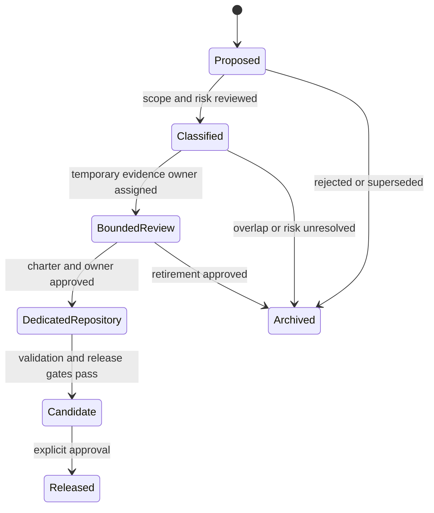
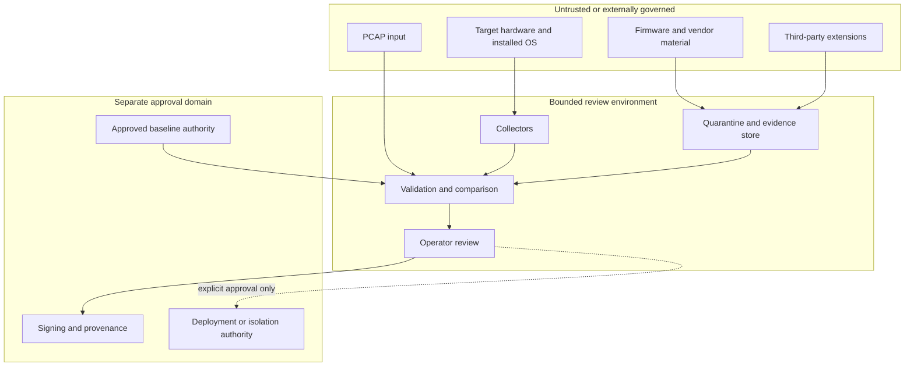

# Repository Boundaries

## Why this repository is different

`Misc` is a holding and incubation repository. It may preserve experiments while their ownership is decided, but it must not become authoritative simply because code, packaging, or documentation accumulated here.

The XYZ / PhantomBlock subtree therefore has two simultaneous identities:

- **implemented prototype evidence** that must be preserved accurately; and
- **unaccepted product scope** that must not be promoted until an Architect assigns a dedicated owner or records retirement.

## Authority model

XYZ is currently in **BoundedReview**. The source exists, but permanent ownership and release authority do not.

## What `Misc` may own

`Misc` may temporarily own:

- proposal descriptions and decision records;
- prototype source preserved for evaluation;
- synthetic fixtures and non-sensitive examples;
- evidence inventories and limitations;
- migration or retirement plans;
- documentation that accurately distinguishes implementation from acceptance;
- fail-closed controls that prevent accidental publication or promotion.

## What `Misc` must not own permanently

`Misc` must not become the permanent authority for:

- a production Python package or supported API;
- operational firmware, hardware, or network assessment;
- privileged credentials or management-plane integrations;
- trusted firmware or device-baseline distribution;
- customer, incident, PCAP, firmware-image, or sensitive finding storage;
- a production dashboard or fleet service;
- active switch isolation or remediation;
- certification, compliance, authorization, or deployment claims;
- signed release artifacts or long-term vulnerability response.

## Relationship to neighboring repositories

Ownership must be compared against the existing portfolio before a destination is approved.

| Repository class | Potential relationship | Boundary to preserve |
|---|---|---|
| Bridge / verification transport | May carry signed evidence or approvals in a future design. | XYZ must not redefine transport identity, verification authority, or cross-system trust. |
| AionUi / studio interfaces | May visualize reviewed evidence in a future integration. | XYZ must not silently become a general desktop agent platform or product shell. |
| QSO repositories | May consume evidence through explicit contracts. | XYZ must not claim QSO lifecycle, cognition, governance, or orchestration authority. |
| Portfolio Pages | May link to approved public documentation. | Publication must not imply release, certification, or operational availability. |
| Dedicated security repository | Recommended destination if the prototype is retained. | The new repository must receive an approved charter, history, ownership, license, and release controls. |

## Data and trust boundaries

No input becomes trusted merely because it was collected by the prototype. Baselines, firmware sources, extensions, credentials, and response adapters require separate governance.

## Scope-control rules

1. Preserve source and evidence; do not erase inconvenient history.
2. Label every material capability as implemented, configured, tested, proposed, or accepted.
3. Do not treat CI configuration as proof that a current candidate passed.
4. Do not add active integrations while ownership is unresolved.
5. Do not publish documentation automatically from `main`.
6. Do not store real credentials, sensitive findings, proprietary firmware, or customer data.
7. Stop when authority, provenance, authorization, or rollback is unclear.
8. Migrate with history rather than copying only the latest source snapshot.

## Promotion criteria

Promotion into a dedicated repository requires an approved record identifying:

- canonical repository and maintainer;
- intended users and authorized-use policy;
- supported platforms and explicit exclusions;
- package, CLI, API, schema, and version ownership;
- license and third-party rights;
- baseline and firmware provenance governance;
- credential, privilege, extension, and network boundaries;
- validation matrix and representative fixtures;
- publication, vulnerability response, release, and rollback authority;
- migration method that preserves history and outstanding limitations.

Until those items are accepted, the correct repository posture is containment, documentation, and review—not expansion.